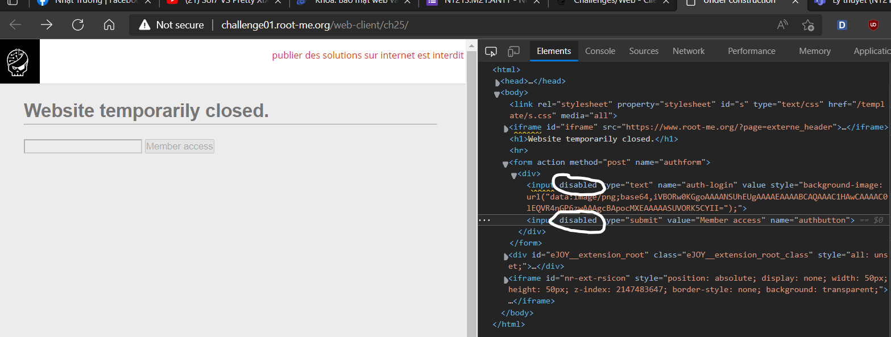
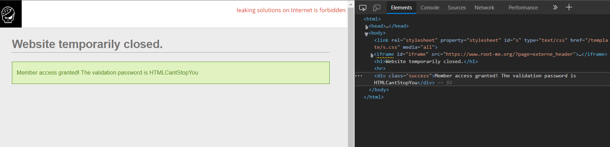

# [HTML - disabled buttons](https://www.root-me.org/en/Challenges/Web-Client/HTML-disabled-buttons)

Đầu tiên, truy cập vào challenge ta thấy được 2 thẻ input đều bị gán thuộc tính *disabled:*

Ta thực hiện xóa thuộc tính này ở 2 thẻ input, sau đó thử nhập vào input auth-login giá trị 1 và submit bằng cách click vào input authbutton:

- Flag: "****************************"
