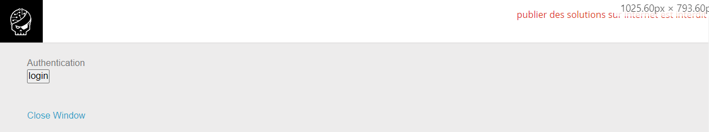

# [Javascript - Authentication 2](https://www.root-me.org/en/Challenges/Web-Client/Javascript-Authentication-2)

Vào website, ta thấy có một nút login và một thẻ &lt;a&gt; để đóng của sổ:



Click vào login button, website sẽ hiện 2 ô alert lần lượt là `username` và `password`. Kiểm tra Sources website, ta thấy có file `login.js`:


Ta thấy, script so sánh `username == TheUsername && password == ThePassword`. Trong khi đó `TheUsername` và ThePassword lần lượt là `TheSplit[0]` và `TheSplit[1]`. Từ đó với `var TheLists = ["GOD:HIDDEN"]`, ta có thể suy ra:

```yaml
Username: GOD
Password: HIDDEN
```


- Flag: "****************************"
