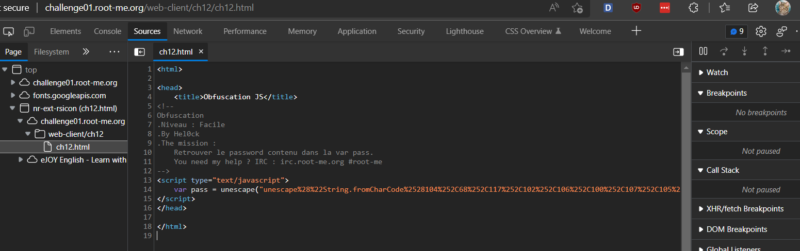

# [Javascript - Obfuscation 2](https://www.root-me.org/en/Challenges/Web-Client/Javascript-Obfuscation-2)

Kiểm tra Sources website, ta thấy có file ch12.html:

Ta thấy, pass lúc này được gán bằng một dòng lệnh Javascript. Lúc này, ta sẽ thử qua Console và chạy các lệnh này:

Lúc này, có vẻ như ta đã tìm được password.

- Flag: "****************************"
