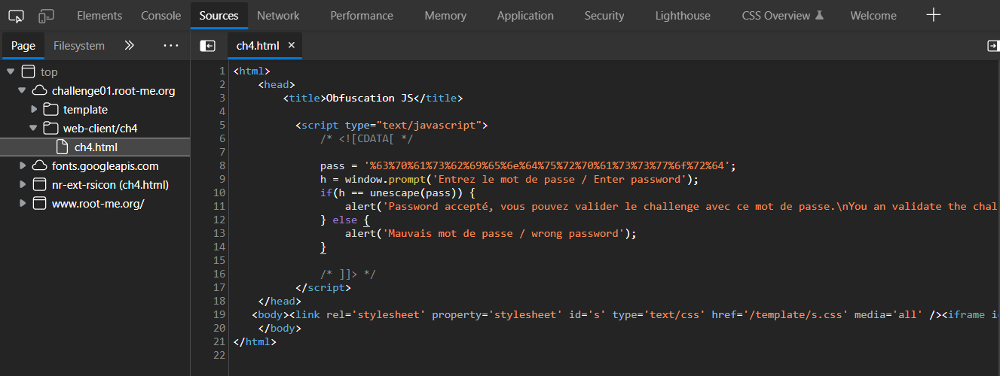
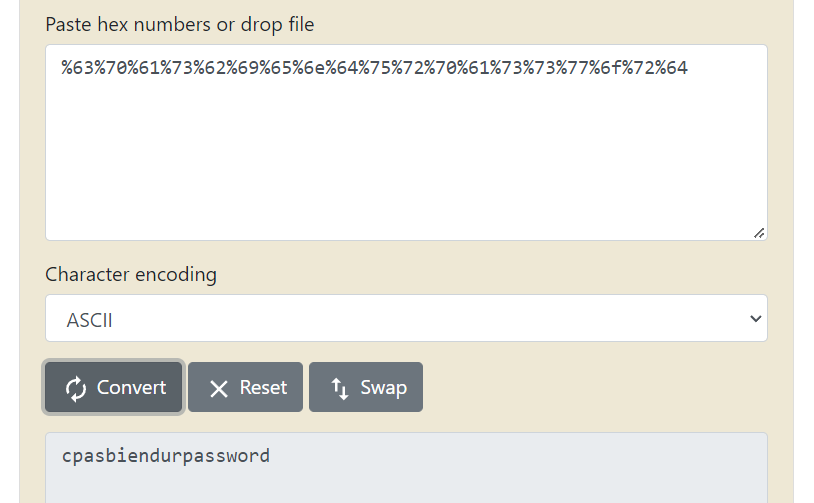

# [Javascript - Obfuscation 1](https://www.root-me.org/en/Challenges/Web-Client/Javascript-Obfuscation-1)

Vào website, website yêu cầu nhập password:

Kiểm tra Sources website, ta thấy có file `ch4.html`:

Ta thấy: `pass ='%63%70%61%73%62%69%65%6e%64%75%72%70%61%73%73%77%6f%72%64'`

Đây là chuỗi hex, ta convert sang ASCII Text và có được password:

- Flag: "****************************"
