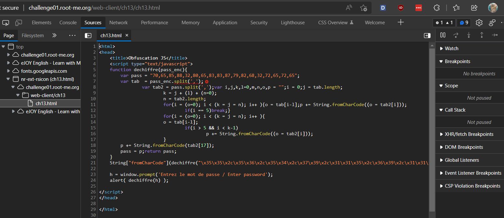
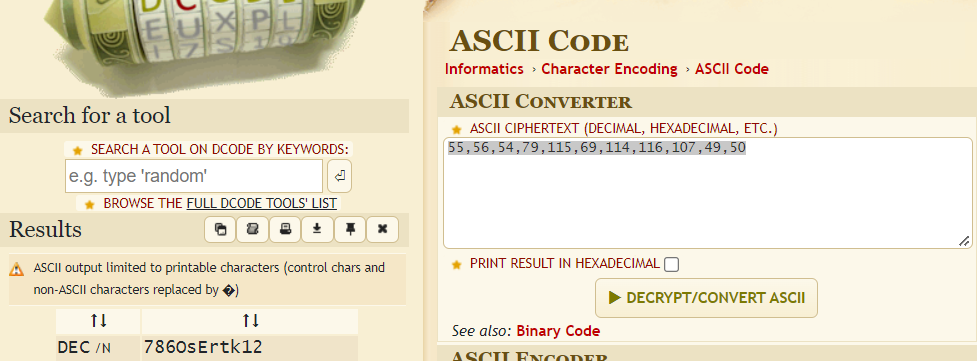

# [Javascript - Obfuscation 3](https://www.root-me.org/en/Challenges/Web-Client/Javascript-Obfuscation-3)

Kiểm tra Sources website, ta thấy có file `ch13.html`:

Decode chuỗi ở biến pass, ta nhận được kết quả `FAUX PASSWORD HAHA`. Đọc lại code, ta thấy, ở dòng 21, script có sử dụng hàm `dechiffre()` để decode một đoạn chuỗi giá trị loại hex. Ta sử dụng công cụ ASCII Code để decrypt nó và được:

Ta nhận được chuỗi `“55,56,54,79,115,69,114,116,107,49,50”`. Chuỗi này có format giống chuỗi ở biến pass, ta decode nó một lần nữa với công cụ ASCII Code và được:

Từ đó, ta suy đoán được, `password = '****************'`

- Flag: "****************************"
