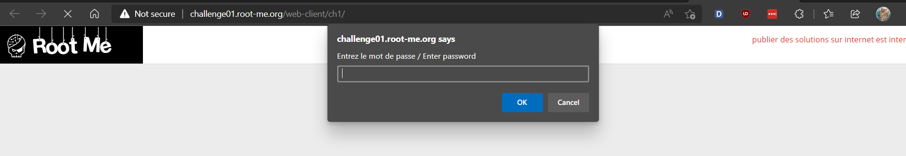
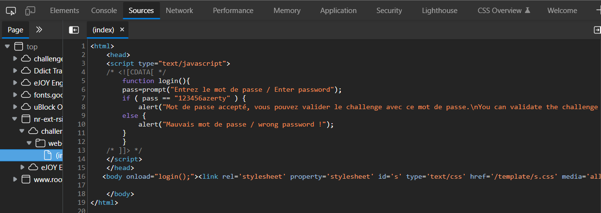

# [Javascript - Source](https://www.root-me.org/en/Challenges/Web-Client/Javascript-Source)

Vào website, ta thấy có một ô alert hiện ra bắt ta nhập mật khẩu:

Kiểm tra Sources của website, ta thấy một file (index):

Đến đây, ta có thể thấy, body sẽ sử dụng event onload để chạy hàm `login()`, hàm `login()` sẽ so sánh password với chuỗi `"123456azerty"`, do đó, ta sẽ sử dụng chuỗi này để nhập vào ô alert ban đầu cũng như vào password của challenge.

- Flag: "****************************"
