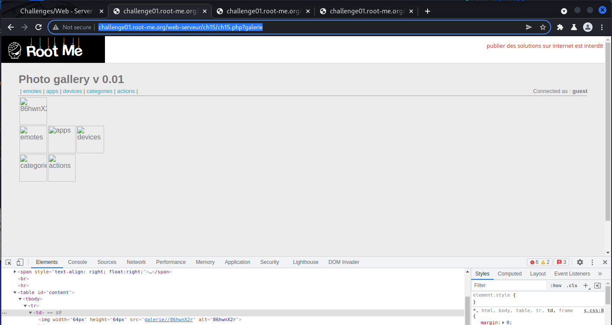

# [Directory Traversal](https://www.root-me.org/en/Challenges/Web-Server/Directory-traversal)

Thử tìm các hình ảnh ở các tab, không phát hiện điều gì khác biệt. Chú ý đến **URL** <http://challenge01.root-me.org/web-serveur/ch15/ch15.php?galerie=emotes> có *galerie=\[value\].* Ta thử xóa đi value để website trả về dạng ‘index’:

Lúc này, website trả về một **alt=“86hwnX2r”.** Chọn **“Open image in new window”** thì nhận được `403 Forbidden`:

Có lẽ galerie lúc này phải là `null` hoặc bằng value nào đó. Ta back về `ch15.php` source web và add vào source link của ảnh đó <http://challenge01.root-me.org/web-serveur/ch15/ch15.php?galerie=86hwnX2r> ta chuyển đến trang khác:

Ảnh password đã xuất hiện, truy cập source password và nhận password <https://challenge01.root-me.org/web-serveur/ch15/galerie/86hwnX2r/password.txt>

- Flag: "****************************"
