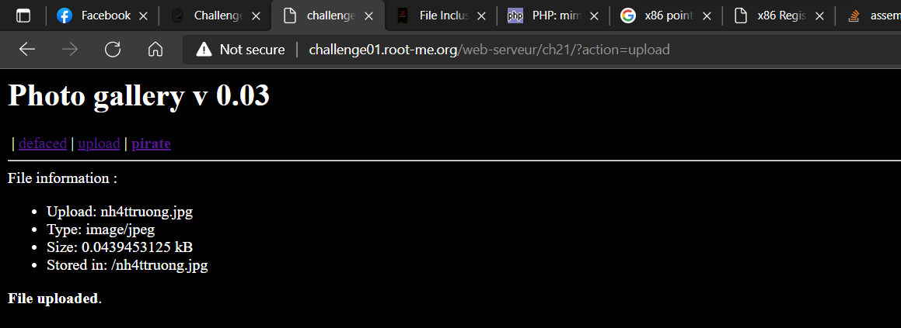

# [File upload - MIME type](https://www.root-me.org/en/Challenges/Web-Server/File-upload-MIME-type)

Đề yêu cầu ta tìm .passwd. Thử check với .passwd tại **/ch21/.passwd** thì nhận được 404 Forbidden:


Website có cung cấp một cổng upload và challenge có đề cập đến **MIME type**. ổng này sau khi nhận file của ta thì lưu trữ tại `./[name]`. Bây giờ ta cần chèn payload vào để push lên server:




URL sau khi upload: <http://challenge01.root-me.org/web-serveur/ch21/galerie/upload/40ce7d3f3fe27d0d9c1970598b6d09a8//nh4ttruong.jpg>

Lúc đầu, ta đã biết .passwd nằm tại …/ch21/.passwd. Do đó, ta cần đi ngược folder 3 lần để đọc được.

Gắn [shell_exec()](https://www.php.net/manual/en/function.mime-content-type.php) vào file `nh4ttruong123.php.jpg`:

```php
<?php  
$output = shell_exec('cat ../../../.passwd');  
echo "<pre></pre>$output</pre>";  
?>
``

Bởi vì server chỉ cho ta upload các file image (jpeg/png/gif), do đó, ta cần sử dụng BurpSuite để modify request convert `.jpg` sang `.php`:


Mod thành công:


Code đã chạy, ta get được password:


- Flag: "****************************"
