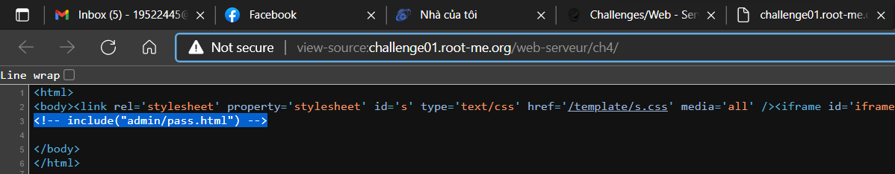
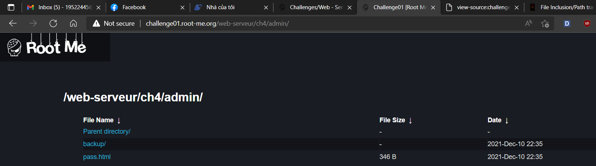
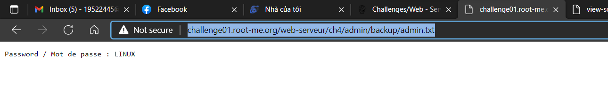

# [HTTP - Directory indexing](https://www.root-me.org/en/Challenges/Web-Server/HTTP-Directory-indexing)

Theo gợi ý từ đề bài **CTRL+U**, ta view-source thì nhận được dòng comment:

Truy cập đến `admin.pass.html` thấy được message rick roll:

Back lại, ta tìm trong folder admin xem có gì:

Mò một lúc thì ta thấy được password nằm tại `admin/backup/admin.txt` (<http://challenge01.root-me.org/web-serveur/ch4/admin/backup/admin.txt>)

- Flag: "****************************"
