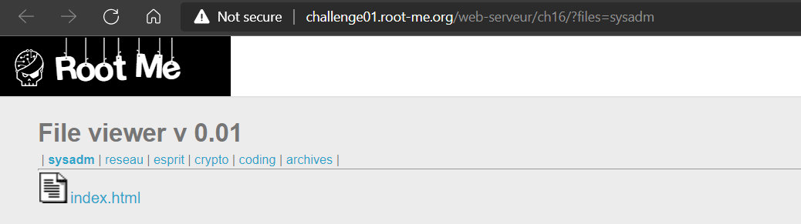
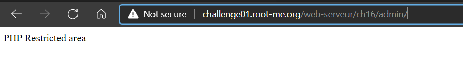
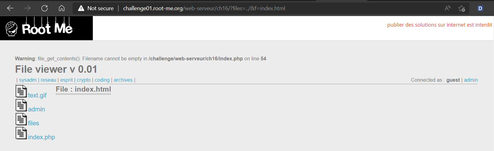
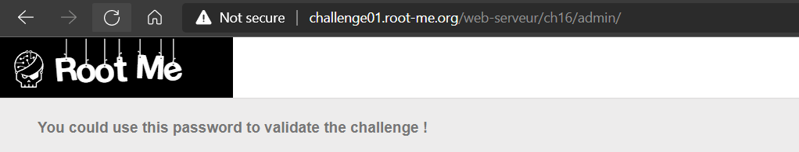

# [Local File Inclusion](https://www.root-me.org/en/Challenges/Web-Server/Local-File-Inclusion)

Website có rất nhiều tab và gây confuse khi làm:



Câu query URL có dạng [challenge01.root-me.org/web-serveur/ch16/?files=sysadm&f=index.html](http://challenge01.root-me.org/web-serveur/ch16/?files=crypto&f=index.html) với files sẽ chỉ định folder và f sẽ chỉ định tệp hoặc folder con mà ta chọn:


Chuyển qua mò tab Admin thì website bắt login. Biết gì đâu mà login :v. Tắt promt login thì ta nhận được dòng text:



Như vậy, website sử dụng backend là PHP. Thử mò file source code của nó dựa theo query ở trên:


Lỗi trả về là `file_get_contents()` không tìm được filename. Sau khi thử fuzz một lúc thì phát hiện ra website không block `‘../’.` Đã đến lúc ta dùng **Path Traversal**.

Thử với `files=../`:



Lúc này, ta thấy được các thư mục cha chứa thư mục files, trong đó, có folder admin. Đặc biệt, website có một file là index.php giống như ở homepage của website. Vậy hướng của ta là xem được các file có trong folder admin (như index.php). Thử trỏ `files=../admin` và `&f=index.php` thì ta đã truy cập thành công index.php:


Dò source code ta thấy được 2 dòng code rất giá trị:


Vậy là đã tìm được account của admin:

```yaml
- Username: admin
- Password: OpbNJ60xYpvAQU8
```



- Flag: "****************************"
