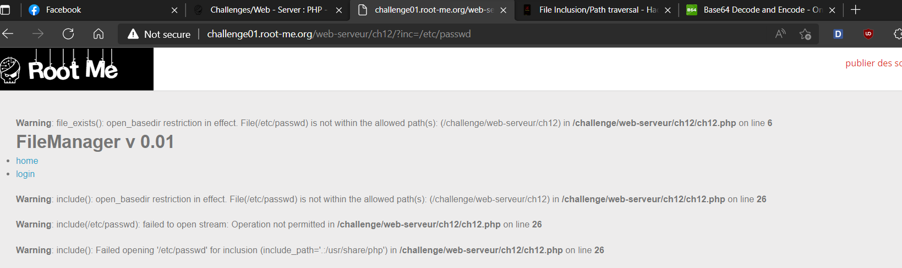
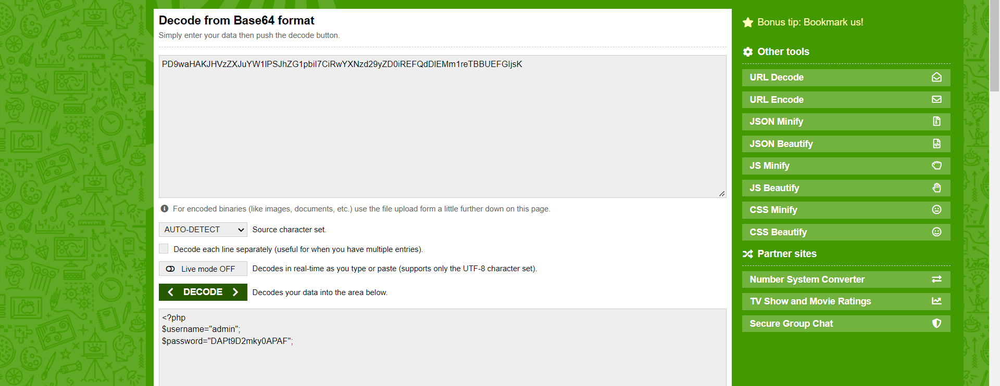
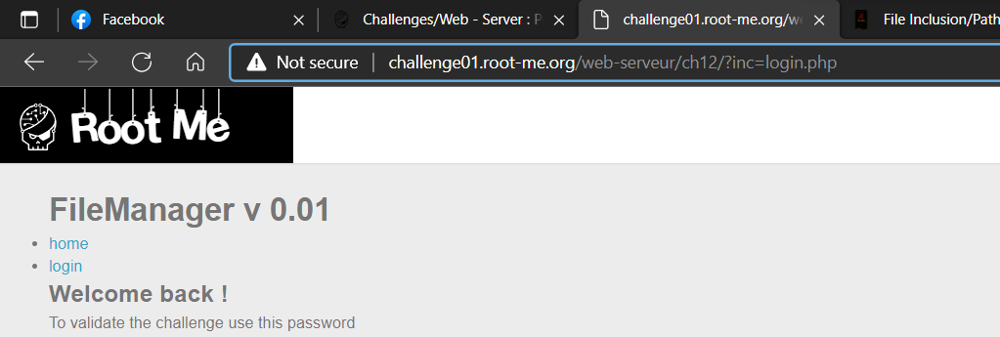

# [PHP - Filters](https://www.root-me.org/en/Challenges/Web-Server/PHP-Filters)

Test payload trực tiếp đến `/etc/passwd` thì nhận được lỗi ràng buộc với `/etc/passwd`.



Thật ra URL không filter keyword của mình nhưng mà không thể nào get nó theo cách này được. Chuyển qua dùng wrapper php với base64 để get source index.php:


Get source **ch12.php**:


Vậy là website có `config.php`, get source `config.php`:




```yaml
Username: admin
Password: DAPt9D2mky0APAF
```




- Flag: "****************************"
