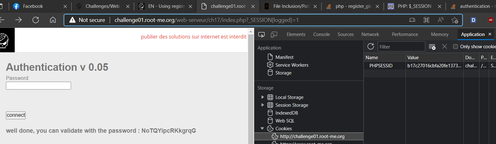

# [PHP – register globals](https://www.root-me.org/en/Challenges/Web-Server/PHP-register-globals)

Theo document, ta có các global variable thường gặp là: `_REQUEST`, `_SESSION`, `_SERVER`, `_ENV`, `_FILES`. Kiểm tra cookie của website, ta có thể thấy được PHP Session ID. Từ đó, ta có thể đoán được website có thể sử dụng `_SESSION` để lưu trữ mảng các session ([PHP: $_SESSION - Manual](https://www.php.net/manual/en/reserved.variables.session.php)).


Thử bằng payload với `/index.php?_SESSION[logged]=1`, ta tìm được password:



```yaml
Password: **NoTQYipcRKkgrqG**
```


- Flag: "****************************"
