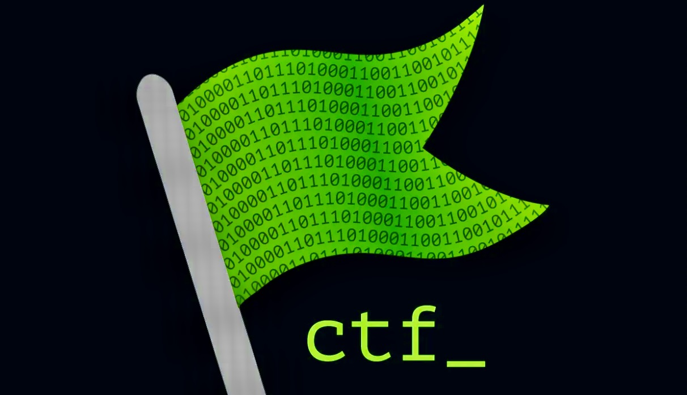

# Root Me Solutions & Write-ups

This repository offers write-ups and solutions for [Root Me CTF challenges](https://nh4ttruong.github.io/emtoor), aimed at educational and ethical hacking practice. It provides step-by-step guides for various web security, application security, and digital forensics challenges.

> [!IMPORTANT]
> Please read the [**Disclaimer**](https://nh4ttruong.github.io/emtoor/disclaimer.html) before "dive" into the challenges.

---

## Categories

This repository is organized into several categories, each focusing on different aspects of cybersecurity challenges:

| Category                                                                         | Description                       |
| -------------------------------------------------------------------------------- | --------------------------------- |
| [Cross-Site Scripting](https://nh4ttruong.github.io/emtoor/Cross-Site-Scripting) | XSS attack techniques & solutions |
| [CSRF Challenges](https://nh4ttruong.github.io/emtoor/CSRF)                      | Cross-Site Request Forgery        |
| [PHP Vulnerabilities](https://nh4ttruong.github.io/emtoor/PHP)                   | File inclusion, upload, etc.      |
| [SQL Injection](https://nh4ttruong.github.io/emtoor/SQL-Injection)               | SQLi types and bypasses           |
| [Steganography Challenges](https://nh4ttruong.github.io/emtoor/Steganography)    | Hidden data in files/images       |
| [Forensics](https://nh4ttruong.github.io/emtoor/Forensics)                       | Digital forensics challenges      |

> [!WARNING]
> This is just my solution approach and it may not be correct at the time you attempt the challenge.

> [!NOTE]
> 🚩Flags are redacted for compliance. Guides are detailed for self-learning and education purpose only.

---

## Contributors

- [@nh4ttruong](https://github.com/nh4ttruong)