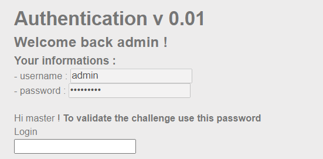

# [SQL injection - Authentication](https://www.root-me.org/en/Challenges/Web-Server/SQL-injection-authentication)


Thử với payload:
```yaml
Username: `1’--`
Password: `1`
```


Như vậy, ta không thể inject được vào input. Thử inject vào password:
```yaml
Username: `1`
Password: `1’ or 1=1--`
```


Ta có thể đoán được, có vẻ như cần phải có username chính xác mới có thể inject được ở username, thử kiểm chứng bằng cách inject ở username với payload `user1—`.


Như vậy, để trộm được password của admin, ta cần phải biết username của admin để thực hiện inject. Và nhờ informations hiển thị của user1, ta có thể đoán username của admin có thể là **admin** hoặc **administrator.**

**Thử với payload:**
```yaml
-   Username: `admin’--`
-   Password: `1`
```



Inspect và tìm được password của admin:


- Flag: "****************************"
