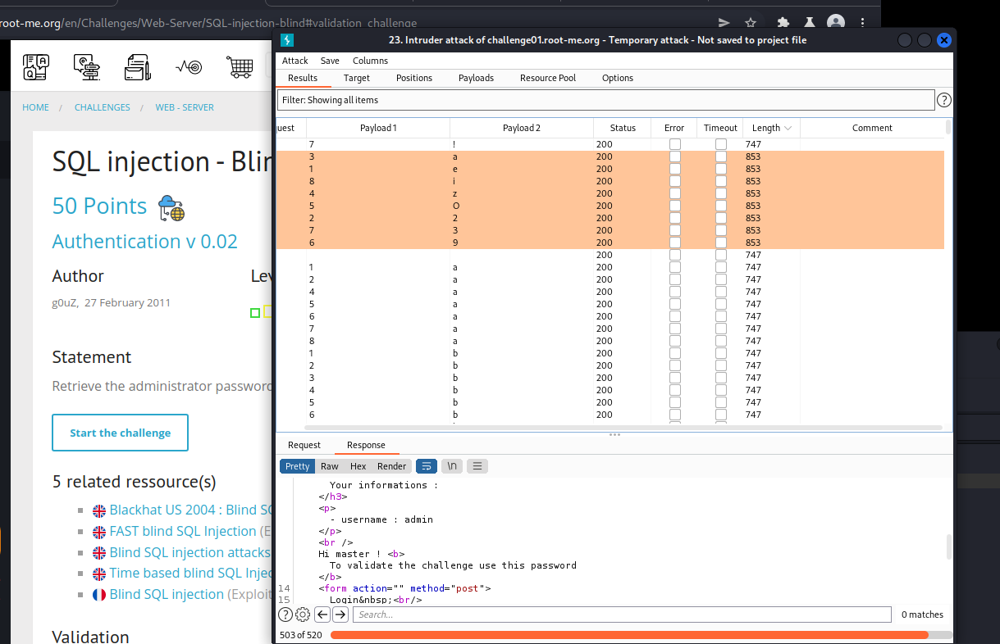

# [SQL Injection - Blind](https://www.root-me.org/en/Challenges/Web-Server/SQL-injection-blind)

Thử fuzz với payload `admin’-- -` ta đã access thành công qua Authentication v 0.02. Tuy vậy, website chẳng trả về cho thông tin password gì cả:

Mở burpsuite và tìm kiếm thôi. Thử thay đổi payload bằng cách sử dụng union select thì phát hiện ra website đã filter các keyword chông SQL Injection với thông báo **“Injection detected”**:

Với blind injection, ta thực hiện mò thử với các cấu trúc mà server database hay tạo, fuzz thôi:

Với payload:

`username=admin%27+AND+(select+username+from+sqlite_master)='admin'--+-&password=admin%27--+-`

Server trả về là TRUE fuzz tìm password bằng substr() thôi!

1.  **Tìm length(password):**

-  Length(password) == 8

1.  **Tìm password:**

Payload để fuzz:

*username=admin%27+AND+substr((select+password+from+sqlite\_master),1,1)='a'--+-&password=admin%27--+-*

Sau một khoảng thời gian, ta đã ghép được `password: e2a*********3i`

- Flag: "****************************"
