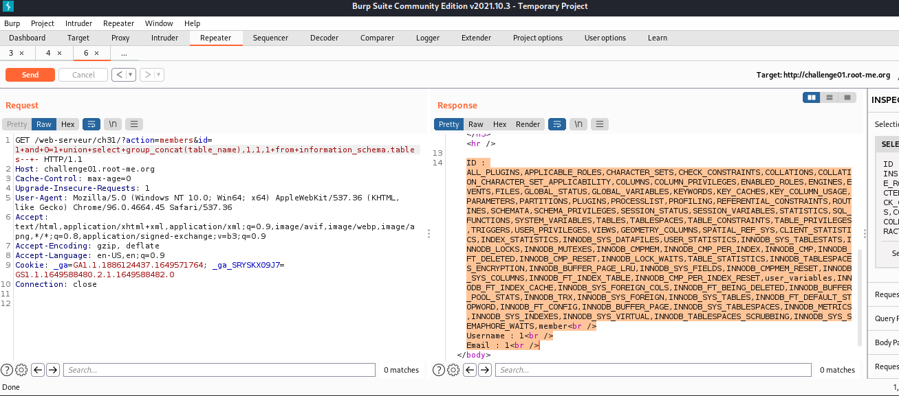
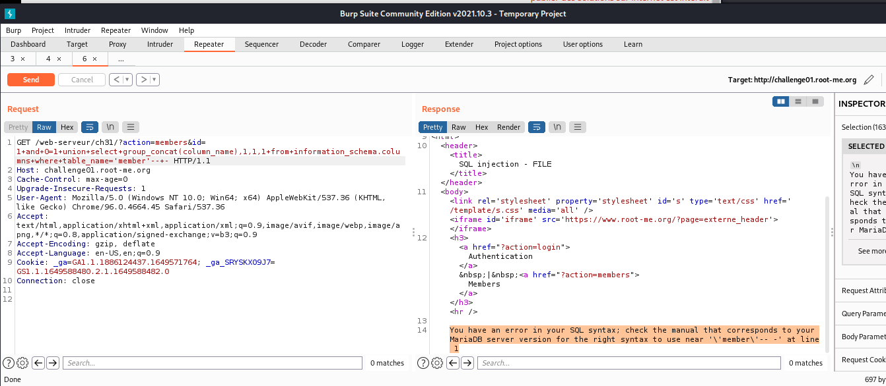
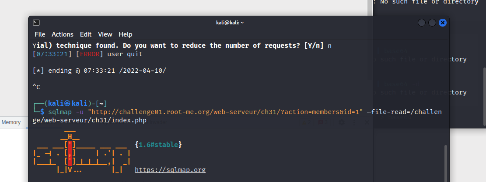
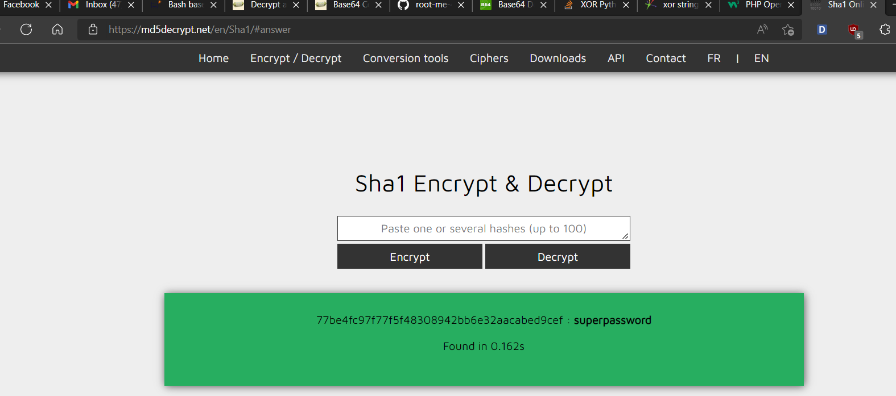

# [SQL injection – File reading](https://www.root-me.org/en/Challenges/Web-Server/SQL-injection-file-reading)

Ở tab Members, ta tìm được thông tin cơ bản của admin. Từ đây, thử fuzz với URL bằng burpsuite để tìm kiếm điều khác biệt:

Bắt đầu tìm kiếm số cột:

-   Có 4 cột

Sau một hồi fuzz, ta đã tìm được các bảng của dtb:

Payload: `id=1+and+0=1+union+select+group_concat(table_name),1,1,1+from+information_schema.tables--+-`

Ta thấy, có table `‘member’`, tiến hành tìm column của nó. Tuy nhiên, dtb đã filter mất tiêu:

Thử convert `‘member’` hex value: `0x6D656D626572`

-   `member_id,member_login,member_password,member_email`

Tìm password thôi. Tuy nhiên, đến lúc này database k constaint table_name nữa, ta có payload: `id=1+and+0=1+union+select+member_login,member_password,1,1+from+member`

Đến đây, ta nhận được một chuỗi base64 nhưng decode ra không phải password. Sau khi mò mẫm vô ích, nhìn lại tên bài là file reading, ta có thể đoán rằng, tất cả sẽ nằm trong source code tại index.php. Ta sẽ sử dụng sqlmap để tìm ra source web:

Source code cho ta thấy, password đã bị hash bằng **SHA1**, sau đó bị **stringxor** với base64 của chính nó.

Giờ thì hiểu nó rồi, ta sử dụng python để stringxor ngược lại thành SHA1:

-   SHA1 password: `77be4fc97f77f5f48308942bb6e32aacabed9cef`

-   Password: `supe*********word`

- Flag: "****************************"
