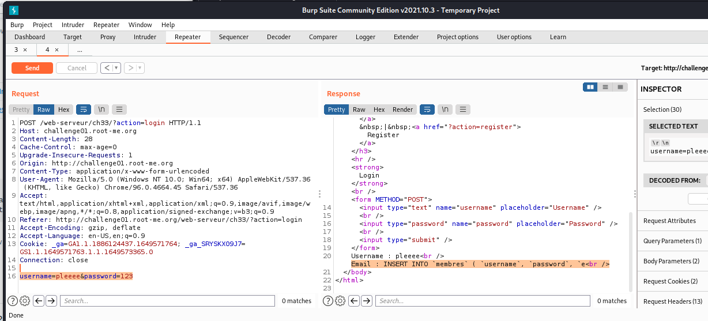
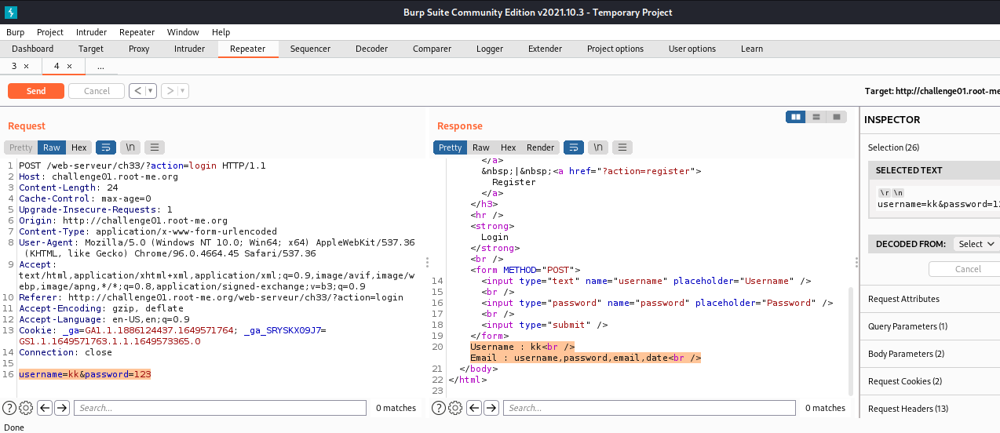
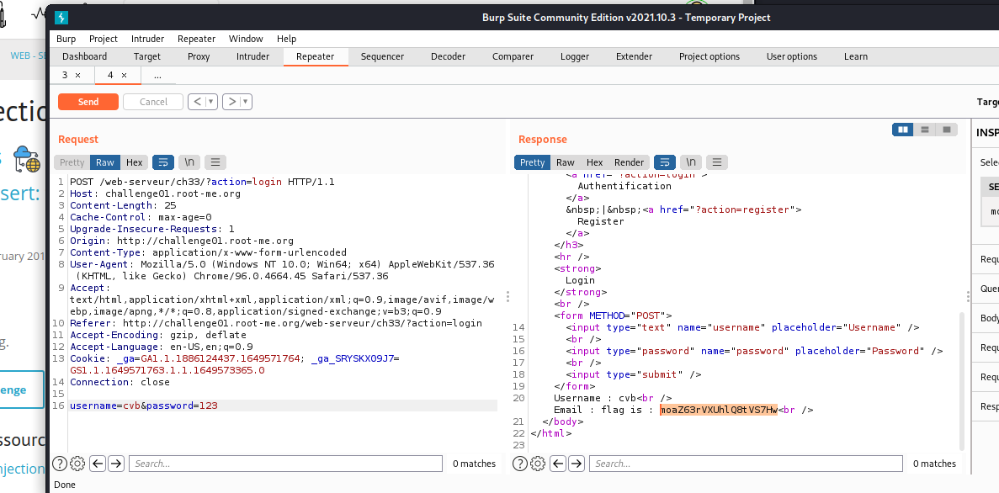

# [SQL injection - Insert](https://www.root-me.org/en/Challenges/Web-Server/SQL-injection-Insert)

Website cho ta 2 tab gồm authentication và register. Ở Register, ta có thể tùy ý tạo được account và không hề có filter input.

Từ đó, ta xác định chỗ để tiêm vào database. Ở tab register, ta có thể thấy website yêu câu 3 field gồm username, password và email. Do đó, database sẽ thực hiện tạo user theo kiểu:
`INSERT INTO users VALUES (username, password, email)`

Trong khi đó, website không hề filter email field và ta có thể lợi dụng bug này để có thể INSERT thêm các giá trị ta muốn với multiple insertions và tấn công vào email field.

**Payload:** `INSERT INTO users VALUES (username, password, email), (sth, sth, attack_payload)-- -`

Login vào account, `ss, ss, (select version()):`

-   Database version(): `10.3.34-MariaDB-0ubuntu0.20.04.1`

Tiếp tục, ta cần fuzz để tìm ra được table và column, nhưng khi thử thì bị message **“Request failed”** cho đến khi sử dụng LIMIT thì mới biết là nó bị giới hạn:

Thử sử dụng trick với OFFSET thì được response **“Attack detected”.**

Login vào account vừa INSERT, ta biết được 1 table:

Sử dụng **GROUP_CONCAT** để show các table nhưng có vẻ không có tables nào có thông tin user hoặc flag mà toàn là các table khác.:

Thử xem lại version, ta thấy server sử dụng MariaDB. Sau một hồi stuck và check cheatsheet, ta có thể sử dụng **information_schema.processlist** để check các thread đang thực thi của server database (vì user có thể reg bất cứ lúc nào). Lúc này, ta có thể kiểm tra table **INFO** để có thể xem server sẽ thực thi cái gì khi reg account ([Information Schema PROCESSLIST Table - MariaDB Knowledge Base](https://mariadb.com/kb/en/information-schema-processlist-table/)):

Reg acc để show table **INFO** của **information_schema.processlist**:

Payload thực thi của server:

***INSERT INTO `membres` ( `username`, `password`, `email`)***

-   Table cần tìm: **membres**

Show các column của membres table:

Tuy vậy, ta chẳng kiếm được bất kỳ thông tin nào từ bảng membres này cả

Sau 2 tiếng stuck, vì quá bất lực, em quyết định sử dụng burpsuite để bruteforce tất cả các table của **information_schema.tables:**

-   Auto register account:

-   Auto login:

-   Sau khi xem qua các table mà bruteforce giúp ta leak, ta đã tìm được đúng table cần tìm :

Đến đây, ta thực hiện tìm column trong flag table:

-   Payload: `username=uuysyy&password=123&email=gg'),('cgc','123',(select column_name from information_schema.columns where table_name='flag' limit 0,1))-- -`

Giờ thì tìm flag: `username=sadadas&password=123&email=gg'),('cvb','123',(select flag from flag limit 0,1))-- -`

- Flag: ******************************

- Flag: ******************************