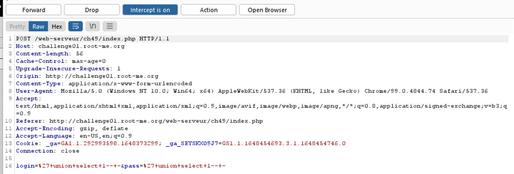
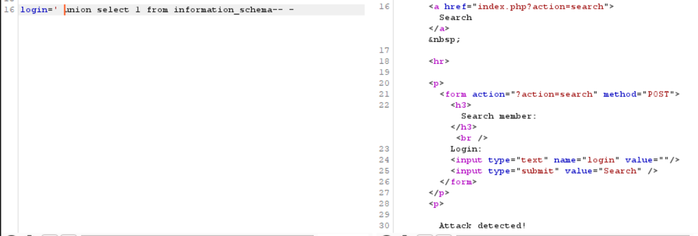

# [SQL-Injection-Routed](https://www.root-me.org/en/Challenges/Web-Server/SQL-Injection-Routed)

Thử login và intercept request, ta có được kết quả:

Có vẻ như khó có thể bypass được ở hàm login này khi request trả về:

 Chuyển qua tab Search, khi query ta đều nhận được kết quả trả về dựa trên query:

Ta sẽ attack vào đây với payload `‘ union select 1 from information_schema-- -` thì nhận được response **“Attack detected!”**:

 Thử fuzz ta biết được, input sẽ filter các ký tự như ‘,’, các ký tự có thể liên quan đến SQLi. Tuy nhiên không filter một vài từ như union, select,…

Tìm hiểu về Routed SQL ([https://repository.root-me.org/Exploitation - Web/EN - Routed SQL Injection - Zenodermus Javanicus.txt](https://repository.root-me.org/Exploitation%20-%20Web/EN%20-%20Routed%20SQL%20Injection%20-%20Zenodermus%20Javanicus.txt)) ta có thể tìm được thông tin:

In simple words routed SQL injection can be a scenario when you are not able to see any output after using "union select", earlier when i was playing with SQLi i found a website where i wasnt getting any output so it just striked through my mind that may be the output is not coming to the page then it must be going somewhere, and that somewhere is an another sql query.

Nghĩ là, khi ta inject với union select thì sẽ không thể thấy được input của câu inject đó.

Payload: `'union select login,password from users-- -`

Convert sang hexa: `0x27756e696f6e2073656c656374206c6f67696e2c70617373776f72642066726f6d2075736572732d2d202d`

- Flag: *********************
