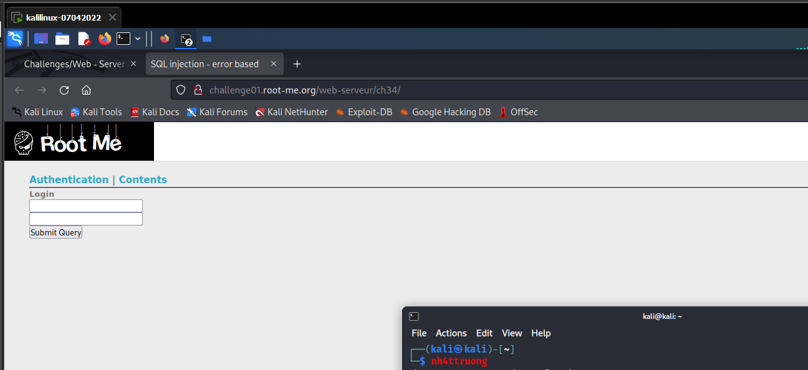
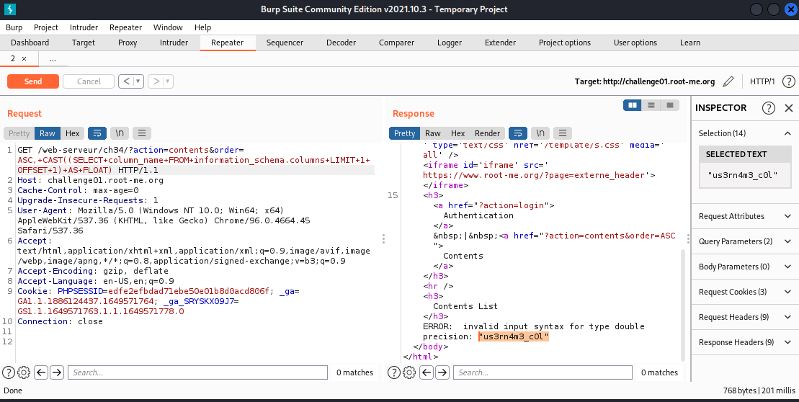
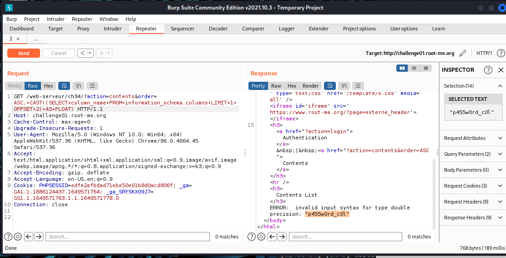
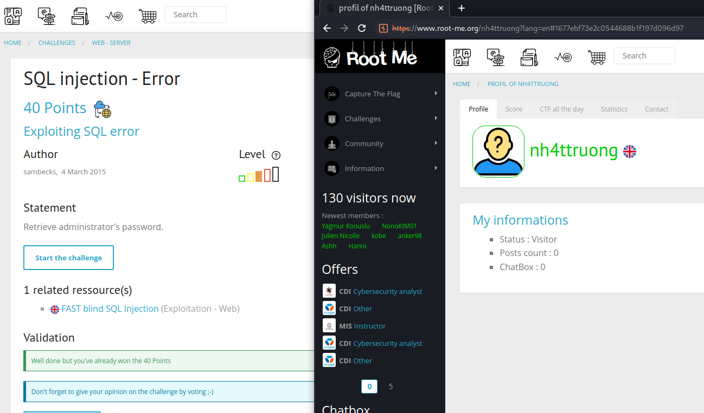

# [SQL injection - Error](https://www.root-me.org/en/Challenges/Web-Server/SQL-injection-Error)

Website cung cấp cho ta 2 tab (Authentication và Contents), tuy vậy, khi fuzz SQLi vào Authentication thì không có kết quả khả thi. Chuyển qua tab Contents, ta phát hiện ra website sẽ res về lỗi cho ta:

Thử fuzz các payload dựa vào `“ORDER BY”`:

Có thể thấy, với `position==3` hoặc `VARCHAR/CHAR` type thì database res về lỗi. Như vậy, ta cần phải hiết 3 position của database này cũng như dựa vào type varibles để attack. Dựa vào cheatsheet của MySQL, ta có thể sử dụng `CAST … AS [type]` để khiến database res về error khi postion không thể là `VARCHAR/CHAR`. Mở burpsuite và thử payload:

Lỗi res về cho ta biết, website sẽ chỉ hiển thị 1 row. Đến đây, ta có thể sử dụng LIMIT để filter res về 1 row:

-   Table name: `m3mbr35t4bl3`

-   Column name (first column): `id`

Đến đây, ta cần sử dụng OFFSET để có thể filter vào đúng postion ta cần LIMIT để hiển thị các column còn lại:

-   Username column: `us3rn4m3_c0l`
-   Password column: `p455w0rd_c0l`

-   Username của admin: `admin`
-   Password của admin: `1a2BdKT5DIx3qxQN3UaC`

- Flag: "****************************"
