# Steganography

Root-me link for this subject: [https://www.root-me.org/en/Challenges/Steganography/](https://www.root-me.org/en/Challenges/Steganography/)

## Table Of Contents
- [EXIF - Metadata](#exif---metadata)
- [Dot and next line](#dot-and-next-line)
- [Steganomobile](#steganomobile)
- [Twitter Secret Messages](#twitter-secret-messages)
- [Poem from Space](#poem-from-space)
- [Yellow dots](#yellow-dots)
- [WAV - Noise analysis](#wav---noise-analysis)
- [EXIF - Thumbnail](#exif---thumbnail)
- [WAV-Spectral-analysis](#wav-spectral-analysis)
- [APNG – Just a PNG](#apng--just-a-png)
- [TXT - George and Alfred](#txt---george-and-alfred)
- [Embedded PDF](#embedded-pdf)
- [Kitty spy](#kitty-spy)
- [Crypto Art](#crypto-art)
- [PNG - Pixel Indicator Technique](#png---pixel-indicator-technique)
- [PNG - Pixel Value Differencing](#png---pixel-value-differencing)

---

## EXIF - Metadata

Link challenges: <https://www.root-me.org/en/Challenges/Steganography/EXIF-Metadata>

Sử dụng tool để xem exifdata: <https://www.metadata2go.com/>

Ta tìm được GPS location: **43 deg 17' 56.27" N, 5 deg 22' 49.38" E**

Sử dụng Google Maps để định vị location ta tìm được địa chỉ tại: **2 Pl. des Capucines, 13001 Marseille, France:**

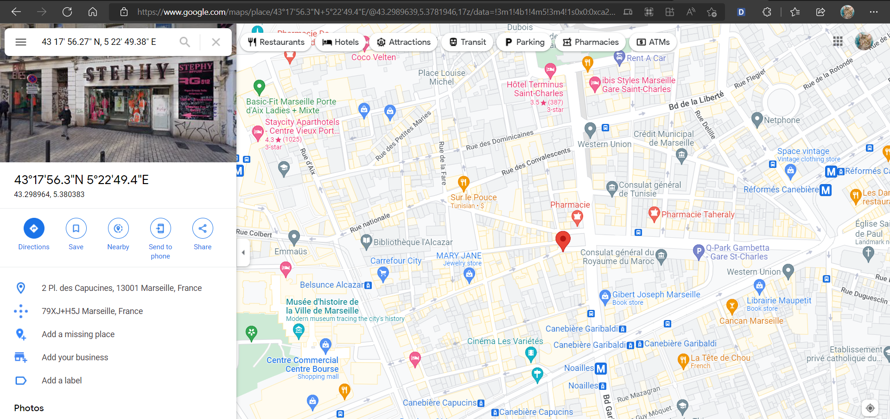

Flag là thành phố nơi chụp bức ảnh.

**Flag:** \*\*\*\*\*\*\*

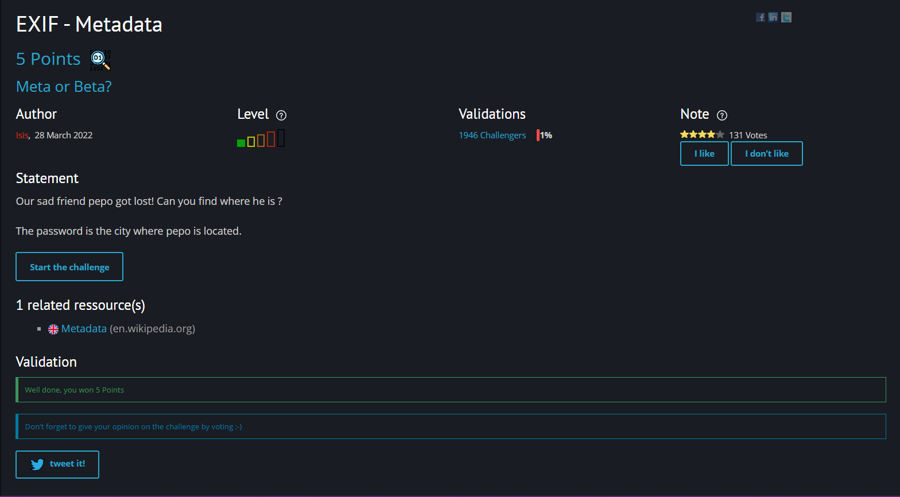

> Back to [Table Of Contents](#table-of-contents)

---

## Dot and next line

Hình ảnh được cho:

Chú ý vào title của challenge, ta có ‘dot’ và ‘next line’ là hai keyword. Chú ý vào hình ảnh được cho, ta có thể thấy được sự sắp xếp ngẫu nhiên và không có quy tắc của các dấu chấm và cả xuống dòng.

Từ tên của challenge, ta đặt ra 2 giả thuyết:

\- Ghép các ký tự bên dưới dấu chấm lại với nhau (dot and next line)

\- Và ngược lại (line and next dot)

Từ đó, ta có 2 kết quả:

\- urpa de (không có nghĩa và dư thừa khoảng trắng)

\- chatelet15h

Submit và thành công

**Flag**: \*\*\*\*\*\*\*

> Back to [Table Of Contents](#table-of-contents)

---

## Steganomobile

Link: <https://www.root-me.org/en/Challenges/Steganography/Steganomobile>

Sử dụng công cụ <https://dcode.fr> để decode nó dưới dạng Multi-Tap Phone ta được kết quả là CELLPHONE.

Thử nhập kết quả nhưng sai. Chuyển sang lowercase thì submit thành công!

**Flag:** \*\*\*\*\*\*\*

> Back to [Table Of Contents](#table-of-contents)

---

## Twitter Secret Messages

Link: <https://www.root-me.org/en/Challenges/Steganography/Twitter-Secret-Messages>

Sử dụng công cụ Twtitter Secret Message: <https://holloway.nz/steg/>

Ta nhận được message: **rendezvous at grand central terminal on friday.**

**Flag:** \*\*\*\*\*\*\*

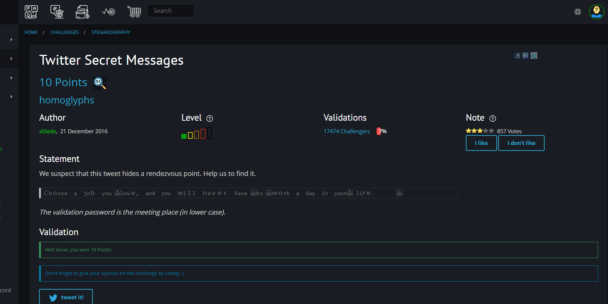

> Back to [Table Of Contents](#table-of-contents)

---

## Poem from Space

Link: <https://www.root-me.org/en/Challenges/Steganography/Poem-from-Space>

Bôi đen file, ta thấy được file có lồng thêm những khoảng trắng (whitespace):

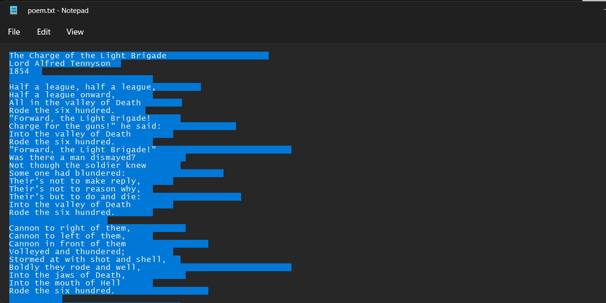

Đây có thể là Whitespace Language. Ta remove các ký tự latin đằng trước đi và để lại các khoảng trắng dư thừa.

Sử dụng công cụ Whitespace Language decode để decode:

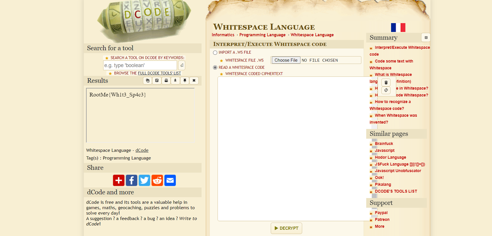

**Flag:** RootMe{\*\*\*\*\*\*\*}

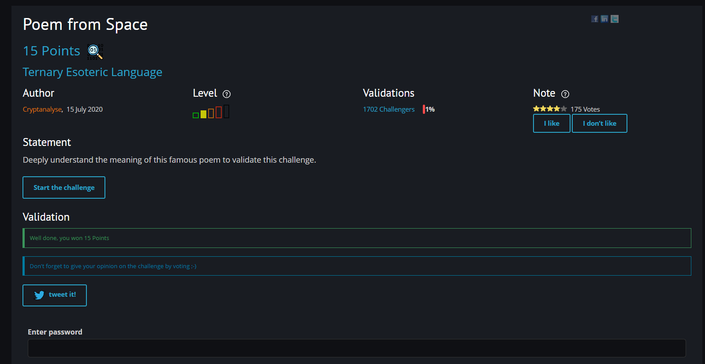

> Back to [Table Of Contents](#table-of-contents)

---

## Yellow dots

Link: <https://www.root-me.org/en/Challenges/Steganography/Yellow-dots>

Tên bài là Yellow dots, ta có thể liên tưởng đến printer. Sử dụng stegsolve để tìm ra điểm khác biệt trong file ảnh:

Hình ảnh khác biệt hiện ra, ta có thể dò nó theo printer serial:

Ta có bảng dò như sau:

**Flag:** \*\*\*\*\*\*\*

> Back to [Table Of Contents](#table-of-contents)

---

## WAV - Noise analysis

Link:<https://www.root-me.org/en/Challenges/Steganography/WAV-Noise-analysis>

Đề bài là một file ch3.wav. Mở lên nghe thì rất khó chịu. Phân tích metadata thì không thu thập được bất cứ gì.

Sử dụng công cụ Audicity để modify âm thanh. Sau nhiều lần thử thì công thức cho ra được một đoạn voice tiếng anh là: Speed Low (giảm còn 30%) + Reverse (đảo ngược đoạn âm thanh):

Nghe lại ta có được flag: **3b27641fc5h0**

**Flag:** \*\*\*\*\*\*\*

> Back to [Table Of Contents](#table-of-contents)

---

## EXIF - Thumbnail

Link: <https://www.root-me.org/en/Challenges/Steganography/EXIF-Thumbnail>

Strings thử file thì thấy mấy không tìm được gì đặc biệt, kể cả exiftool:

Sử dụng công cụ bóc tách thumbnail, <https://29a.ch/photo-forensics/#thumbnail-analysis>, ta được flag:

**Flag:** \*\*\*\*\*\*\*

> Back to [Table Of Contents](#table-of-contents)

---

## WAV-Spectral-analysis

Link: <https://www.root-me.org/en/Challenges/Steganography/WAV-Spectral-analysis>

Sử dụng Audicity tool và chọn chế độ Spectogram để xem. Ta có thể xem được sóng và nó hình thành đoạn text:

**Flag:** \*\*\*\*\*\*\*

> Back to [Table Of Contents](#table-of-contents)

---

## APNG – Just a PNG

Link: <https://www.root-me.org/en/Challenges/Steganography/APNG-Just-A-PNG>

Exiftool kiểm tra file:

Sử dụng công cụ APNG Disassembler 2.9 để extract .apng ra nhiều frame:

Kiểm tra thư mục xuất ra thì có các file text là frame data. Mở các file đầu lên thì thấy các thông số frame có vẻ như đã bị ASCII hóa. Thử dịch ngược lại 4 file đầu thì ra chữ FLAG (70 76 65 71):

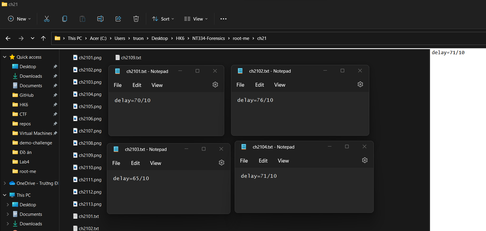

Sử dụng python để decode và ta được flag:

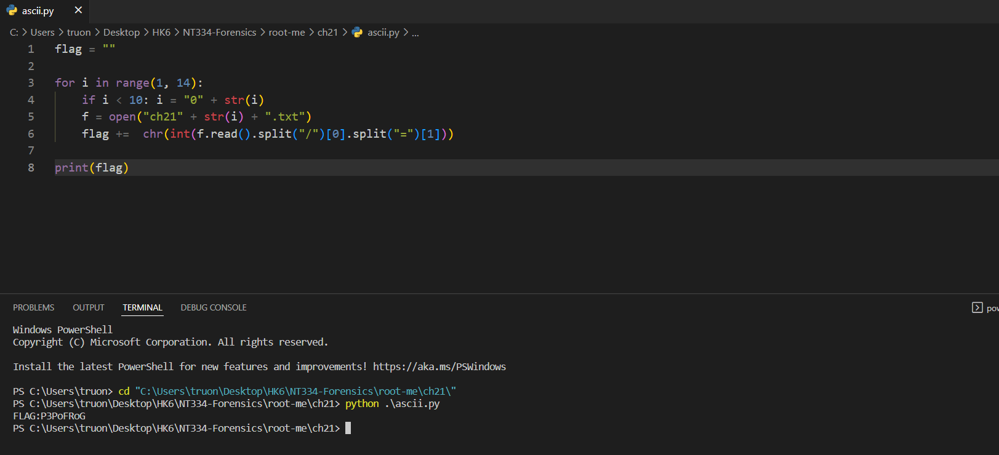

**Flag:** \*\*\*\*\*\*\*

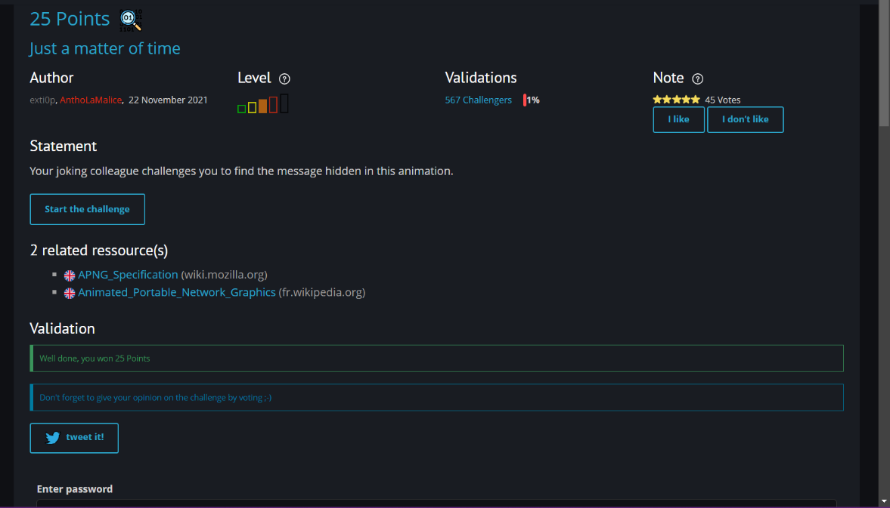

> Back to [Table Of Contents](#table-of-contents)

---

## TXT - George and Alfred

Link: <https://www.root-me.org/en/Challenges/Steganography/TXT-George-and-Alfred>

Mở challenge, ta tìm được đoạn text là bài thơ:

Ở cuối bài, người ta có để một cái hint:

Mở bài gốc, ta biết được, những từ đầu hàng ở đoạn cuối là lời mà Musset gửi đến Georges. Bản của challenge đã thay dòng **“La réponse de Georges Sand :”** à **“De la même manière George Sand a répondu ceci :”.** Dựa vào hint, ở trên, ta có thể đoán được “phrase cachée” là **Cette Nuit**. Thử flag thì thấy passed!

**Flag:** \*\*\*\*\*\*\*

> Back to [Table Of Contents](#table-of-contents)

---

## Embedded PDF

Sử dụng **pdf-parser** để xem cấu trúc của file pdf:

**pdf-parser -w epreuve\_BAC\_2004.pdf**

Ta thấy, file **Hidden\_b33rs.txt** được embedded trong pdf. Do vậy, sử dụng **peepdf** để xem cấu trúc của stream thì thấy Filespec nằm ở object 78, từ đó, ta sẽ extract object 78 ra file:

Extract obect 78 ra hiddenpdf.txt:

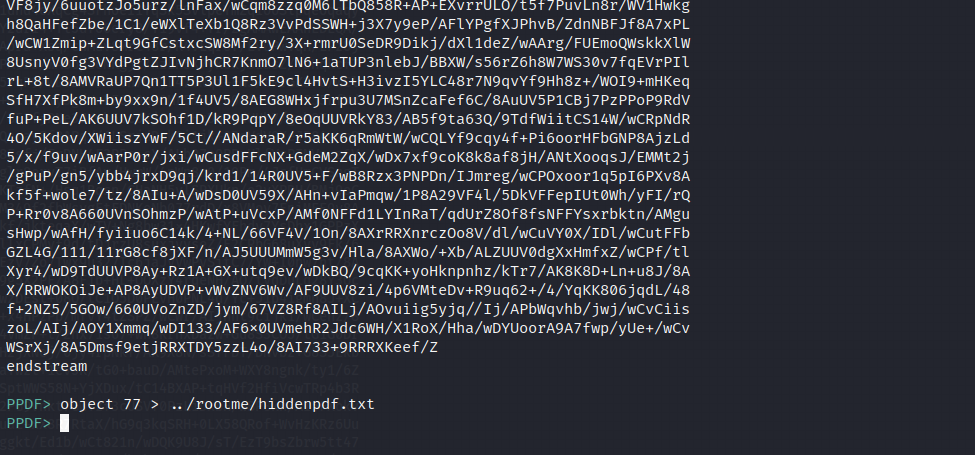

File hiddenpdf.txt:

Data đã bị encode base64, decode nó và xem header thì phát hiện đây là file JFIF:

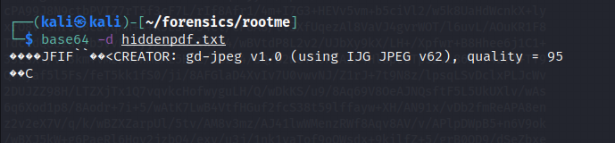

Xuất ra file hidden.jpg, ta có flag:

**Flag:** \*\*\*\*\*\*\*

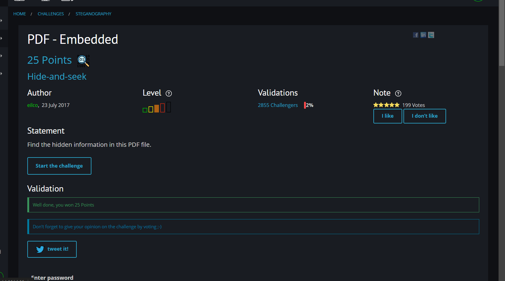

> Back to [Table Of Contents](#table-of-contents)

---

## Kitty spy

Link: <https://www.root-me.org/en/Challenges/Steganography/Kitty-spy>

Binwalk file ch16.jpg ta thấy được các file zip lồng trong file img:

Extract các file zip ra:

Trong step 1, ta có:

Sử dụng stegsolve để xem ảnh dưới nhiều dạng:

Ta được flag ở step1: **\*\*\*\*\*\*\*** (hihi encrypted flag)

Đến step2, ta unzip với pass là flag ở step1:

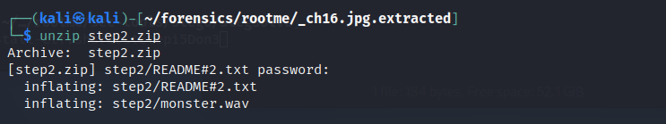

Đọc file README\\#2.txt, ta nhận được một đoạn chữ số khả nghi là MD5: **18574115dbcd47d71e7eb9da74e45bf2**

Sử dụng tool thử tìm đoạn plaintext của nó:

Ta có key: **\*\*\*\*\*\*\*** (hihi encrypted key). Sử dụng steghide để extract file từ monster.wav:

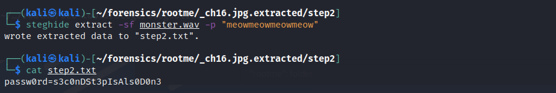

Ta tìm được password ở step 2: **s3c0nDSt3pIsAls0D0n3**

Đến step3, ta có một source web nghi ngờ. Mở file README trong source code, ta nhận được dòng có nội dung như kiểu QR Code sẽ là key ở web này liên quan đến flag:

Mở file LICENSE.md, ta nhận được một đoạn BrainFuck:

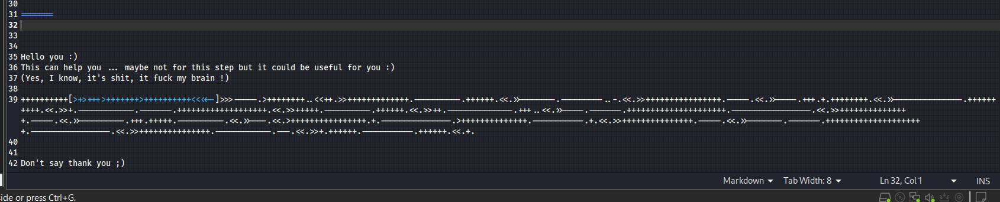

Decode và y như dự đoán rằng, có thể QR Code sẽ hỗ trợ ta ở step này:

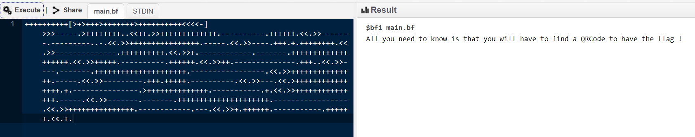

Ở file index.html, ta có được message sau:

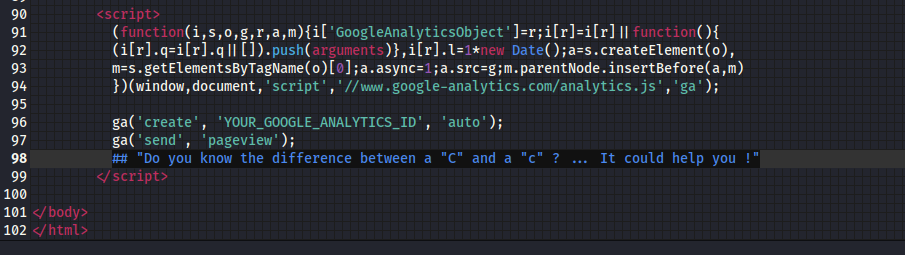

Tui bị dừng lại ở đây là chưa nghĩ ra hướng tiếp theo.

> Back to [Table Of Contents](#table-of-contents)

---

## Crypto Art

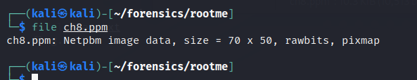

Đây là file Netpbm với đuôi là .ppm.

String file và ta được thông điệp:

Sử dụng dcode.fr để tiên đoán cipher và ta thấy nó hợp nhất Vigenere:

Sau một hồi không thể auto bruteforce được Vigenere thì bài này có lẽ cần phải có key mới có thể decode. Tìm hiểu về ppm thì em phát hiện nó có thể chèn thêm text vào trong đó (hide). Sử dụng npiet language để phiên dịch nó thử:

Cuối cùng ta có key: EYJF**** (hihi encrypted key)

Decode và nhận kết quả:

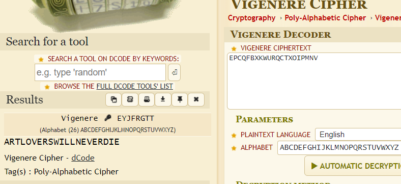

**Flag:** \*\*\*\*\*\*\*

> Back to [Table Of Contents](#table-of-contents)

---

## PNG - Pixel Indicator Technique

Pixel Indicator Technique là kỹ thuật ẩn giấu thông tin vào pixel của ảnh. Sử dụng công cụ stegopit (chuyên cho PIT) để phân tích ảnh của challenge:

Và ta tìm được hidden data:

**Flag:** **\*\*\*\*\*\*\***

> Back to [Table Of Contents](#table-of-contents)

---

## PNG - Pixel Value Differencing

Đây là challenge dựa trên kỹ thuật PVD (Pixel Value Differencing) để ẩn dấu message trong png. Tương tự challenge, ta sử dụng công cụ **stegopvd (**[Tinyscript steganography tool implementing the Pixel Value Differencing algorithm · GitHub](https://gist.github.com/dhondta/feaf4f5fb3ed8d1eb7515abe8cde4880)) để extract message:

**Flag:** **\*\*\*\*\*\*\***

(**[Tinyscript steganography tool implementing the Pixel Value Differencing algorithm · GitHub](https://gist.github.com/dhondta/feaf4f5fb3ed8d1eb7515abe8cde4880)) để extract message:

**Flag:** **\*\*\*\*\*\*\***

