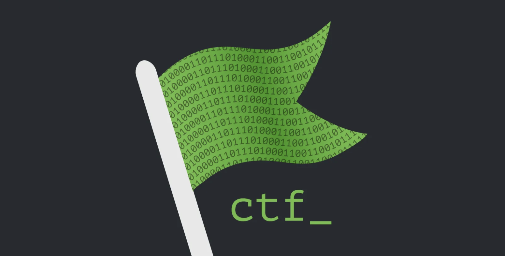

A curated archive of Root Me CTF challenge solutions for educational and ethical hacking practice. This repository provides step-by-step write-ups for a variety of web security, application security, and digital forensics challenges.

## Challenge Categories

This repository is organized into several categories, each focusing on different aspects of cybersecurity challenges:

| Category              | Description                       |
| --------------------- | --------------------------------- |
| Cross-Site Scripting  | XSS attack techniques & solutions |
| CSRF                  | Cross-Site Request Forgery        |
| PHP Vulnerabilities   | File inclusion, upload, etc.      |
| SQL Injection         | SQLi types and bypasses           |
| Steganography         | Hidden data in files/images       |
| Forensics             | Digital forensics challenges      |

> Note: This is just my solution approach and it may not be correct at the time you attempt the challenge.

## Disclaimer

Note that, you should read the [disclaimer](./disclaimer.md) before "dive" into the challenges.

## Contributors

- [@nh4ttruong](https://github.com/nh4ttruong)
